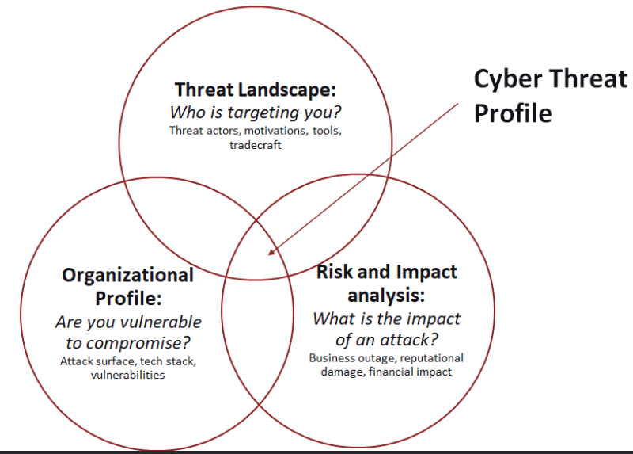
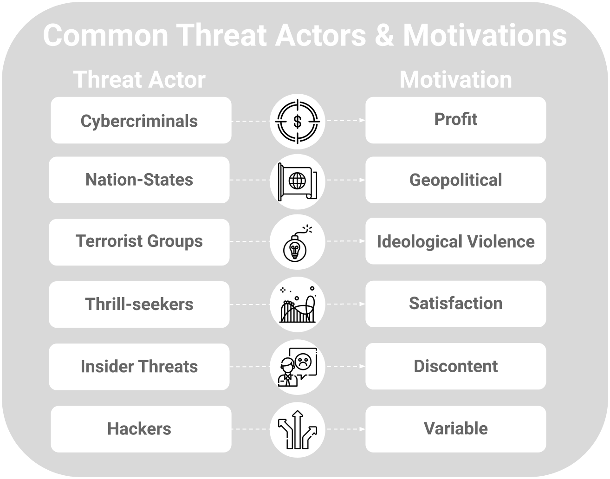
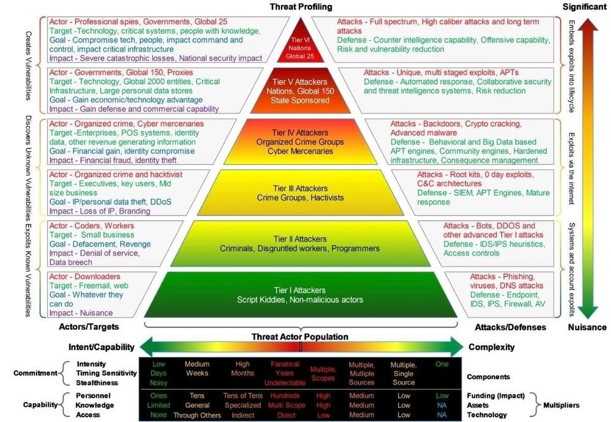
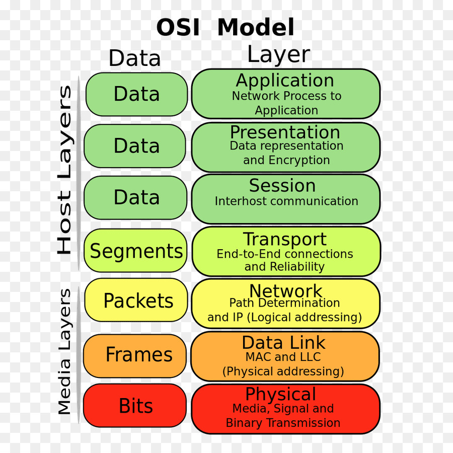
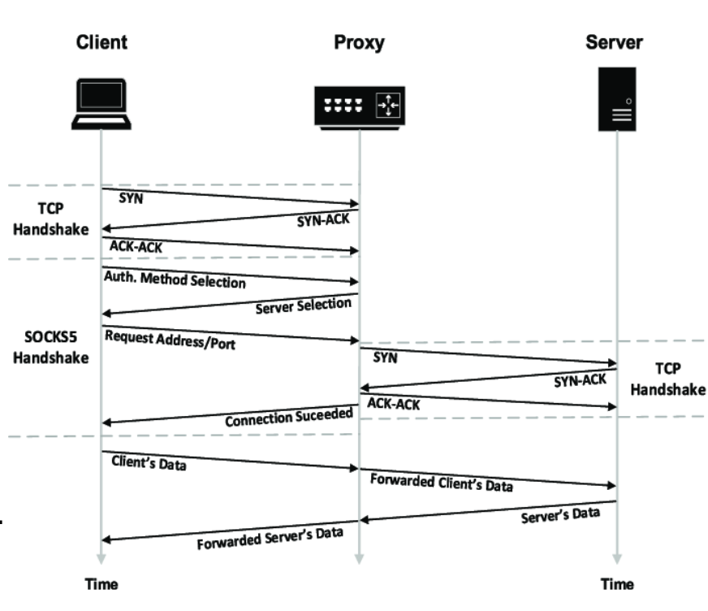

# **Computer Security**

# Lecture 1: Introduction

## What is computer security?
- Computer security deals with protecting data, programs, and systems against intelligent adversaries.
- We become increasingly interconnected, and digitalization is increasing, making the consequences of security failures catastrophic.

## Safety vs Security:
- Safety means being secure against unintended threats.
- Security is the protection against deliberate threats.

## Why is security hard?
- Security is hard to test for.
- Building secure applications requires deep understanding of all technologies involved in the design and implementation of the system.
    - One vulnerability can cripple the system.
    - Not all dependencies are known.
- It is not all technical, users play a role too.
- There is asymmetry between attackers and defenders

## Security principles: CIA triad
- The CIA triad contains the three essential goals in Cyber Security.
- Systems must be **available** to users, users should be able to **trust** (verify) that the data is correct, and data should **not be accessed by unauthorized** persons.

<figure>
  
  <figcaption>CIA Triad</figcaption>
</figure>

### Tools for Confidentiality
- Encryption
    - Ensure that data cannot be read when someone gets their hands on it.
- Access control systems
    - Make it hard to get the data when the user is unauthorized.
- Policies and governance
    - Mandate secure data practices
 
### Tools for Integrity
- Data validation
    - Validate data at various stages to ensure that it is still intact.
    - Tools include Checksums, Digital signatures, Error detection and correction codes.
- Change management and version control
    - Control and document changes to data to ensure transparency and accountability.

### Tools for Availability
- Redundancy and failover
    - Design systems with backup mechanisms to mitigate single points of failure.
- Load balancing
    - Distribute traffic across various resources.
- Monitoring and alerting
    - Monitor for early signs of problems to identify system failures before they become a large issue.

## Computer security threat
### Threat definition
- Threats are potential violations of security posed by attackers.
- When evaluating the security of a program or website, it's essential to consider the context:
    Who is the potential attacker, and what are you defending against?

### Context is Crucial
- Computer security is context-dependent and revolves around a specific attacker or threat model.
- There is no universal solution that can defend against all types of threats.

### Attackers have different profiles and motives
- Consider different potential attackers, each with unique motivations and capabilities.
- When evaluating the security of a program or website, it's essential to consider the context: Who is the potential attacker, and what are you defending against?

### No One-Size-Fits-All
Recognize that security measures should be tailored to specific threats and scenarios.
### Continuous Evaluation
Regularly assess and update security measures based on evolving threat landscapes.
### Layered Defense
Implement a multi-layered security approach to address different levels of threats.

## Threat model
- A threat model serves as a strategic framework that identifies potential attacks and adversaries a system aims to safeguard against.
- Threat models help in understanding and preparing for various security risks.

## Types of threat actors
- Threat actors have varying capabilities. A hacking group backed by a nation has access to much more resources than someone hacking on their own.
- Threat actors have varied motivations, ranging from financial gain to political or ideological reasons.

## Coordinated Vulnerability Disclosure
- CVD is an ethical practice where security researchers or individuals who discover vulnerabilities in a system responsibly report them to the affected organization.

## Bug bounty program
- A Bug Bounty Program is a crowdsourced initiative where organizations offer rewards to ethical hackers (bug hunters) for responsibly discovering and reporting security vulnerabilities.
- Bug bounty programs incentivize ethical hacking to improve cybersecurity.

## Patch adoption is slow
- Organizations need some time before their systems are patched, and often this takes very long or is not done at all.
    - Organizations do not know that they are running a service or that there is a patch.
    - Organizations do not have clear patching guidelines and admins do it on a “best-effort” basis.
- Because patching is slow, there is a window where organizations are vulnerable even after exploits are readily available.

## Security by design
- Security by design is an approach that integrates cybersecurity measures into the design and development processes of systems and applications from the outset.
- Identifying and addressing security risks early in the development process leads to a more secure product.
- Integrating security from the beginning is more cost-effective than retrofitting security measures later.
- Regulatory requirements make it mandatory to think about security in an early stage.

## Defense in Depth
- Defense in Depth is a cybersecurity strategy that involves deploying multiple layers of security controls to protect against various types of threats.
- This reduces the risk of a single security control failure compromising the entire system.

## Usable security
- Usable security is an approach that seeks to integrate effective cybersecurity measures while maintaining a positive and user-friendly experience.
- You can have the best security measures there are, but if it is not usable people will work around them. This can create even more security risks.

---

# Lecture 2 Network Security

Network security is the protection of the underlying networking infrastructure from unauthorized access, misuse, or theft. It involves creating a secure infrastructure for devices, users, and applications to work in a secure manner.

## A Network
A network consists of two or more computers that are linked to share resources, exchange files, or allow electronic communications. The computers on a network may be linked through cables, telephone lines, radio waves satellites, or infrared light beams.

## The OSI Model
The OSI (Open Systems Interconnection) Model is a conceptual framework that standardizes the functions of a telecommunication or computing system into seven abstraction layers.

- In practice we only use five layers.
- Security is important for every single layer

## The physical layer
- Physical security is the first line of defense against unauthorized access, environmental hazards, and theft.
- Without adequate physical security, even the most robust cybersecurity measures can be compromised.

## Physical layer threats
- Unauthorized access to the datacenter.
- Devices can be stolen or modified.
- People can watch what you are doing through the window.
- It is important to identify where cables go, even more so in a shared office environment.
- While working from home, equipment might be more vulnerable.

## Physical layer threats Cables
Cables can be tapped or cut.
### Physical layer threats - Detecting taps
- Physical inspection
- Signal strength analysis
- Cable testing

### Electromagnetic Interference (EMI):
Electrical devices, power cables, and other equipment emitting electromagnetic interference can negatively impact the performance of network cables. Proper cable shielding and
separation from other electronic devices can minimize EMI.

### Rodent or Pest Damage:
Rodents or pests may chew through cables, causing disruptions to network connectivity. Proper cable management and protective coverings can help prevent such damage.

## Guided vs unguided media
A guided medium is a communication channel where the signals are guided along a physical path.
- Copper cables, fiber cables, ...
- Physical access is needed to tamper with the data on the cable.

An unguided medium refers to a communication channel where the signals propagate freely through the air or space.
- Radio waves
- Infrared waves
- Access control on unguided media is hard

Wireless security through range limitation?

Directional antennas:
Just because you cannot get a signal, it doesn’t mean no one can.

## Signal security
- Spread signals over multiple frequencies to counter jamming.
- Frequency hopping aims to change frequencies very fast in a pattern that is unknown to an attacker.
- Authenticating and encrypting data sent over wireless signals can ensure integrity and confidentiality.

___

# Lecture 3 Attacks on Avialability

Availability can be attacked on every layer of the OSI model.
- The best-known attack is a DDoS attack, overwhelming a system with a lot of traffic.

Such as:    - HTTP flood (Appication layer)
            - TCP SYN flood (Transport layer)
            - ICMP (Ping) Flood (Network layer)
            - WiFi Deauthentication (Data link layer)
            - Cut wire (Physical layer)

## What is a DoS attack?
- A Denial of Service (DoS) attack overwhelms a target system with a flood of traffic,  rendering it unavailable to users.
- Attackers aim to disrupt services, causing financial losses or reputational damage.

DDoS – Cheap to perform, expensive to mitigate
## Types of DoS attacks
- Volumetric Attacks
    - Overwhelm victims with a high volume of traffic.
    Ex: Amplification attack
- Protocol Attacks
    - Exploit vulnerabilities in network protocols.
    Ex: TCP SYN Flood
- Application Layer Attacks
    - Target specific applications to exhaust resources.
    - Application layer attacks specifically target the highest layer of the OSI model, focusing on the application and services provided to end-users.
    - The traffic generated by this attack is harder to identify as malicious traffic, as it closely resembles normal user traffic.
    EX: HTTP Flood

### Types of DoS attacks - Amplification attack
- How can attackers overwhelm victims with a high volume of traffic?
- One way is to use an intermediary server that returns a large response to a query to create an Amplification attack.
- Requirements for this attack are:
    - A server that provides large responses on small queries.
    - The ability to spoof an IP address.

- Can be done with many protocols, commonly over UDP.
- A popular protocol is DNS, where the attacker spoofs the IP address of a victim.
- DNS response to a TXT query (+- 21 times amplification)

### Types of DoS attacks - Protocol attack
- Instead of congesting the Internet line, attackers also target protocols to drain resources of a system to the point where the system no longer functions.
- These attacks do not need as much bandwidth as volumetric attacks but do need some exploitable element in a protocol.
- Targets the Network and Transport layer.
- A common protocol attack is the TCP SYN Flood.
    - Send many SYN packets to overwhelm the server, becaues some memory is allocated for each connection.

#### Defenses – TCP SYN Cookies
    - Increasing the amount of “waiting” connections does not protect us. We need to shift the burden away from our server.
        - For each SYN packet Put some cryptographic value in the sequence number
        - Verify the value from the ACK number.

#### Measuring TCP SYN Floods:
The target of the SYN flood attack will replay to those random ips wiht SYN-ACK.
- SYN-ACKs scatter over the Internet, being sent to random IP addresses.
- If we have a lot of IP addresses, we can identify ongoing attacks.
- This traffic is called backscatter.

### Types of DoS attacks - HTTP Flood
- In a HTTP Flood, the attacker requests many pages, images, and/or other (large) files from a website at once.
- As the attacker must complete the TCP handshake to do this, the attack cannot be spoofed.

## DDoS Mitigation
- Redundant network infrastructures ensure that a single point of failure cannot bring down the entire system.
- Traffic filtering aims to identify malicious packets and block them.
- Content Delivery Networks distribute and cache content over a large network, which can absorb and mitigate the DDoS traffic by serving content from distributed servers.
- Web Application Firewalls can protect against application layer attacks by identifying malicious traffic.

## Botnets
- Definition: A botnet is a network of compromised computers (bots) that are under the control of a single entity, usually a malicious actor.
- Purpose: Botnets are typically used for various malicious activities, including distributed denial of service (DDoS) attacks, spreading malware, and stealing sensitive information.

### Architecture of a botnet
- Infected devices (bots)
    - Can be any device: IoT, PC, Phones, ...
- Command and control (C2 or C&C) infrastructure
    - The bots receive commands through the C2 infrastructure.
- Communication channels
    - Many protocols/methods are used: IRC, HTTP, P2P, Blockchain, ...

### Mitigating botnets
- Securing many devices to make harder to compromise a large number of devices.
- Mirai was successful due to trivial security measures.
- Taking down command and control infrastructure.
- The servers are often located in multiple countries and require collaboration between law-enforcement agencies.
- Blocklisting devices that are infected by a botnet so that owners clean them.

### Domain Generation Algorithm (DGA)
- A static domain name or IP address can be blocked.
- Malware authors generate many domain names and only have to register one.

### Peer to peer architecture
- Command and Control servers might be taken down.
- Using the bots as C2 channel makes the botnet redundant.

### Sending the C2 location through the blockchain
- Complete control over the C2 location, and changeable at any moment.
- Decentralized by design, blockchain will not be taken down.

---

# Lecture 4 Firewalls
In computing, a firewall is a network security system that monitors and controls incoming and outgoing network traffic based on predetermined security rules. 
A firewall typically establishes a barrier between a trusted network and an untrusted network, such as the Internet.

## What is a firewall?
- Firewalls divide the untrusted outside of a network from the more trusted interior of a network.

- Often, they run on dedicated devices:
    - Less possibilities for compromise – no compilers, linkers, loaders, debuggers, programming libraries, or other tools an attacker might use to escalate their attack.
    - Easier to maintain with a few accounts.
    - Physically divide the inside from outside of a network.

## The importance of firewalls
- It prevents (vulnerable) services to be accessed from outside the network.
- It segments networks.
- It reduces the attack surface.

## Firewall rules example
- The website at 192.168.1.5 should be reachable from the Internet.
- The Internal DNS server at 192.168.1.8 should be able to reach other DNS servers.
- Other connections should be denied.

## Firewall in the network model
- A firewall compares network traffic to a set of rules. To match the rules to the traffic, it must process several packet layers to obtain the needed data.
- For example: to allow the webserver to be reached, packets need to be processed up to the transport layer.

## Linux firewall: IPTables
- A user-space program that allows administrators to configure packet filter rules of the Linux kernel firewall.

## Types of firewalls
- Firewalls can be implemented in Software or Hardware:
    - Software – Slower, but easier to deploy on single machines.
    - Hardware – Faster, can be safer, but expensive.
- Firewalls can differ in the amount of Network Layers they process:
    - Packet size (data link layer)
    - MAC (data link layer) and IP (IP layer) filtering
    - Port filtering (transport layer)
    - Deep packet (application layer)

### Types of firewalls – packet filtering firewall
- The simplest type of firewall – compares packet header information to a set of rules.
- Very fast – A minimal amount of processing is required. 
- Many rules are needed, making the firewall hard to maintain and prone to human error.
- Allows access to services based on network data, does not allow for the blocking of specific application commands.

### Types of firewalls – stateful inspection firewall
- Maintains state between packets, allowing for more complex rules.
- Similar to packet filtering but remembers past events, allowing for rules that allow traffic from outside if the connection was started from inside the network.
- Stateful inspection firewalls can be used to keep track of TCP sequence numbers and block connections that are acting suspicious.
- Some stateful firewalls can inspect a limited amount of application-layer data for well-known protocols.
- Keeping state is more expensive than simply packet filtering.

### Types of firewalls – application-level gateway
- Also called application proxy.
- Relays application layer data between user and application.
- Can be used to block specific features of an application that you do not want to be used.
- Requires a lot of processing and does not scale well as it needs to be able to parse the application context.
- It filters incoming node traffic to certain specifications (which can include IP address, HTTP headers, protocol, time of request, etc.) which means its capacity for network traffic is quite large.
- This type of gateway is great for regulating traffic because it can, for example, block certain websites or contain harmful content from entering the network.

### Types of firewalls – circuit-level gateway
- Also called circuit-level proxy.
- Relays application layer data between user and application.
- Does not parse the application layer contents, but determines which connections are allowed.
- An example of such a firewall is a SOCKS proxy.
- This type of gateway works on the session layer of the OSI model.
- It is very effective when certain trusted internal computers need to access an outside network.
- It does not filter packets.
- Instead, when a session is initiated (from an inside computer to an outside one), the gateway sets up a circuit between the two computers, allowing packets to flow freely between them.
- This means it's not great for large amounts of traffic because it doesn't regulate the packets that flow through the circuit.

#### SOCKS proxy
- A SOCKS proxy is a circuit-level gateway that allows for the creation of a secure connection between a client and a server.
- The client connects to the proxy, and the proxy connects to the server.
- The proxy relays the application-layer data between the client and the server.
- The proxy does not parse the application-layer data, but it does determine which connections are allowed.

    1. A user authenticates with the proxy.
    2. The user requests a specific IP and port.
    3. If the user is allowed to make that connection, the proxy sets up a connection to the IP and port and relays the application-layer data.
    

## Firewall use-case – TCP SYN scan
Attackers often scan a network to find vulnerable services.
- Using a stateful firewall to block excessive scanning (and bruteforcing).
- If attackers scan slow enough, they will still be able to scan the network.

## Internet-wide scanning
- Tools such as ZMap can be used to scan the entire Internet very quickly, even as fast as 6 minutes from a single machine.
- Search engines such as Censys and Shodan provide databases of running services on the Internet.

### Internet-wide scanning detection
- People are scanning the entire Internet, so every IP address will see these scanning packets.
- By looking at network traffic we can identify unsolicited packets. If we monitor on many IP addresses, we get a good overview of who is scanning the Internet.

## De-Militarized Zone (DMZ)
- A DMZ is common in network architectures to allow some services to be reached from the Internet.
- The Internal network is separated from the DMZ using a second firewall, which can be used for more stringent filtering.

### Different levels of security
- For your companies “crown jewels”, physically separating infrastructure can be key to keep them safe.
- High value systems are “air-gapped” and can only be accessed from specific terminals that are physically protected.
- Data diodes can allow traffic to flow in, but no traffic to flow out.

## Virtual Private Network (VPN)
- Accessing a (corporate) network from the outside is dangerous and therefore (usually) firewalled.
- Sometimes is required to link multiple facility networks over the Internet or provide employees with a way to work from multiple places securely.
- A VPN can be used to encrypt data on lower layers to create a “transparent” tunnel that allows users to connect securely to a LAN network over the Internet.

- **IPSec** is a protocol that adds an extra part to the Network layer, allowing to connectthrough a firewall onto a network.
- It is usually cheaper than having private Internet cables.

## Intrusion Detection
Firewalls aim to prevent attacks by reducing attack surface, but do not often detect attacks.
    - You cannot block all traffic in a firewall.
    - Attacks have multiple stages, all allowing for detection.

### Intrusion detection system (IDS)
An intrusion detection system is a device or software application that monitors a network or systems for malicious activity or policy violations.

### Types of intrusion detection systems
- An IDS can be either:
    - Host-based (HIDS) – Monitors events on a host, such as system logs.
    - Network-based (NIDS) – Monitors network data and can use deep-packet inspection to identify malicious activity.
- IDS can have different types:
    - Heuristic – Matches data to pre-defined rules.
    - Signature – Matches data to known indicators (e.g. flagged IP addresses)
    - Anomaly – Determines what is “normal data” and identifies data that deviates from the norm.

#### Anomaly detection
- Starts by gathering base-line data to consider as “normal”.
- Classifies data using a variety of approaches:
    - Statistical – using various mathematical models.
    - Knowledge based – relying on expert knowledge to classify observed behavior.
    - Machine-learning – Automatically determine whether the observed data matches the baseline.

### Alert fatigue is a big problem
- Too many alarms lead to a situation where analysts do not have the time to investigate them.
- Difficult trade-off between the sensitivity of an IDS and the number of False Positives generated by the system.
- Some insurance policies will not cover attacks that you knew about but did nothing to mitigate.
- Too much noise in an IDS can be a liability.

### Host-based IDS
- Monitors activity on a system.
- A virus scanner is a type of HIDS.
- Common data sources for a HIDS include:
    - System call traces
    - Log files
    - Integrity checksums
    - Registry access patterns

#### Distributed HIDS
- A distributed HIDS collects all data of various systems in the same place to create a more effective IDS.
- This requires devices in the network to run programs that collect telemetry and forward it to a central location.
- There can be privacy concerns when collecting information about the systems of employees.

### Network-based IDS
- Monitors activity on a network.
- Two types of sensors:
    - Inline    
    - Passive
- The location of the sensor matters a lot.

#### Location of sensors in a network
- Sensors can be placed in many parts of the network:
    - Behind the border firewall or at the level of the border firewall.
    - In the DMZ.
    - In a specific part of the network, such as the network segment with employee devices.
- The traffic collected is different at every point, depending on the threat profile of the organization.

#### Sending traffic to a NIDS
- Switches have SPAN ports that can be used to copy all data received on the switch.
- If the switch receives more data than the SPAN port or the ethernet cable can handle, the data is not complete.
- A wiretap on the raw network line will also provide a copy of the data and might be more complete.

### Honeypots
- A honeypot is a decoy system that is designed to lure potential attackers away from critical systems.
- A honeypot has several goals: 
    - Divert attackers away from accessing real systems.
    - Collect information about the goals of an attacker.
    - Alert administrators of strange behavior.
- Honeypots are set up such that there is no reason to ever contact them, so if they are contacted there is a reasonable chance that it is malicious.

## Recap
- Firewalls are useful to limit the attack surface in a network.
- What Internet scanning is and how it is blocked using a firewall.
- Different intrusion detection systems and what they are used for.
