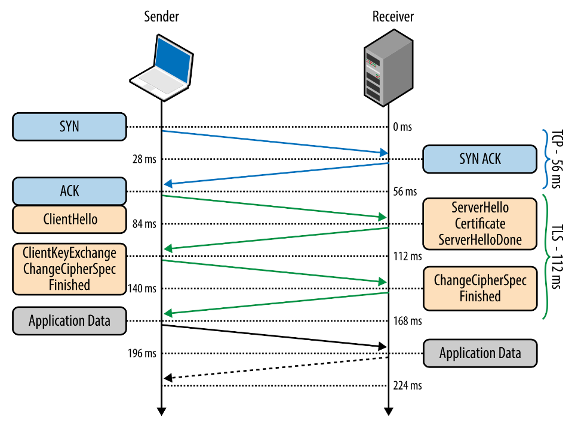
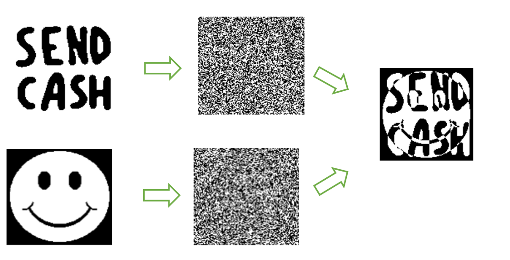
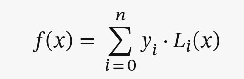
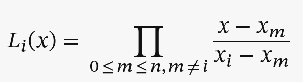
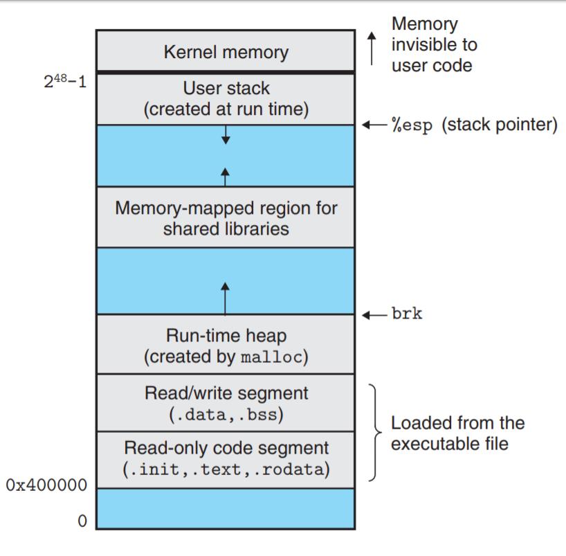

# **Computer Security**

# Lecture 1: Introduction

## What is computer security?
- Computer security deals with protecting data, programs, and systems against intelligent adversaries.
- We become increasingly interconnected, and digitalization is increasing, making the consequences of security failures catastrophic.

## Safety vs Security:
- Safety means being secure against unintended threats.
- Security is the protection against deliberate threats.

## Why is security hard?
- Security is hard to test for.
- Building secure applications requires deep understanding of all technologies involved in the design and implementation of the system.
    - One vulnerability can cripple the system.
    - Not all dependencies are known.
- It is not all technical, users play a role too.
- There is asymmetry between attackers and defenders

## Security principles: CIA triad
- The CIA triad contains the three essential goals in Cyber Security.
- Systems must be **available** to users, users should be able to **trust** (verify) that the data is correct, and data should **not be accessed by unauthorized** persons.


<figure>
  
  <figcaption>CIA Triad</figcaption>
</figure>


### Tools for Confidentiality
- Encryption
    - Ensure that data cannot be read when someone gets their hands on it.
- Access control systems
    - Make it hard to get the data when the user is unauthorized.
- Policies and governance
    - Mandate secure data practices
 
### Tools for Integrity
- Data validation
    - Validate data at various stages to ensure that it is still intact.
    - Tools include Checksums, Digital signatures, Error detection and correction codes.
- Change management and version control
    - Control and document changes to data to ensure transparency and accountability.

### Tools for Availability
- Redundancy and failover
    - Design systems with backup mechanisms to mitigate single points of failure.
- Load balancing
    - Distribute traffic across various resources.
- Monitoring and alerting
    - Monitor for early signs of problems to identify system failures before they become a large issue.


## Computer security threat
### Threat definition
- Threats are potential violations of security posed by attackers.
- When evaluating the security of a program or website, it's essential to consider the context:
    Who is the potential attacker, and what are you defending against?

### Context is Crucial
- Computer security is context-dependent and revolves around a specific attacker or threat model.
- There is no universal solution that can defend against all types of threats.

### Attackers have different profiles and motives
- Consider different potential attackers, each with unique motivations and capabilities.
- When evaluating the security of a program or website, it's essential to consider the context: Who is the potential attacker, and what are you defending against?


### No One-Size-Fits-All
Recognize that security measures should be tailored to specific threats and scenarios.
### Continuous Evaluation
Regularly assess and update security measures based on evolving threat landscapes.
### Layered Defense
Implement a multi-layered security approach to address different levels of threats.

## Threat model
- A threat model serves as a strategic framework that identifies potential attacks and adversaries a system aims to safeguard against.
- Threat models help in understanding and preparing for various security risks.


## Types of threat actors
- Threat actors have varying capabilities. A hacking group backed by a nation has access to much more resources than someone hacking on their own.
- Threat actors have varied motivations, ranging from financial gain to political or ideological reasons.


## Coordinated Vulnerability Disclosure
- CVD is an ethical practice where security researchers or individuals who discover vulnerabilities in a system responsibly report them to the affected organization.

## Bug bounty program
- A Bug Bounty Program is a crowdsourced initiative where organizations offer rewards to ethical hackers (bug hunters) for responsibly discovering and reporting security vulnerabilities.
- Bug bounty programs incentivize ethical hacking to improve cybersecurity.


## Patch adoption is slow
- Organizations need some time before their systems are patched, and often this takes very long or is not done at all.
    - Organizations do not know that they are running a service or that there is a patch.
    - Organizations do not have clear patching guidelines and admins do it on a “best-effort” basis.
- Because patching is slow, there is a window where organizations are vulnerable even after exploits are readily available.


## Security by design
- Security by design is an approach that integrates cybersecurity measures into the design and development processes of systems and applications from the outset.
- Identifying and addressing security risks early in the development process leads to a more secure product.
- Integrating security from the beginning is more cost-effective than retrofitting security measures later.
- Regulatory requirements make it mandatory to think about security in an early stage.

## Defense in Depth
- Defense in Depth is a cybersecurity strategy that involves deploying multiple layers of security controls to protect against various types of threats.
- This reduces the risk of a single security control failure compromising the entire system.

## Usable security
- Usable security is an approach that seeks to integrate effective cybersecurity measures while maintaining a positive and user-friendly experience.
- You can have the best security measures there are, but if it is not usable people will work around them. This can create even more security risks.

---

# Lecture 2 Network Security

Network security is the protection of the underlying networking infrastructure from unauthorized access, misuse, or theft. It involves creating a secure infrastructure for devices, users, and applications to work in a secure manner.

## A Network
A network consists of two or more computers that are linked to share resources, exchange files, or allow electronic communications. The computers on a network may be linked through cables, telephone lines, radio waves satellites, or infrared light beams.

## The OSI Model
The OSI (Open Systems Interconnection) Model is a conceptual framework that standardizes the functions of a telecommunication or computing system into seven abstraction layers.


- In practice we only use five layers.
- Security is important for every single layer

## The physical layer
- Physical security is the first line of defense against unauthorized access, environmental hazards, and theft.
- Without adequate physical security, even the most robust cybersecurity measures can be compromised.

## Physical layer threats
- Unauthorized access to the datacenter.
- Devices can be stolen or modified.
- People can watch what you are doing through the window.
- It is important to identify where cables go, even more so in a shared office environment.
- While working from home, equipment might be more vulnerable.

## Physical layer threats Cables
Cables can be tapped or cut.
### Physical layer threats - Detecting taps
- Physical inspection
- Signal strength analysis
- Cable testing

### Electromagnetic Interference (EMI):
Electrical devices, power cables, and other equipment emitting electromagnetic interference can negatively impact the performance of network cables. Proper cable shielding and
separation from other electronic devices can minimize EMI.

### Rodent or Pest Damage:
Rodents or pests may chew through cables, causing disruptions to network connectivity. Proper cable management and protective coverings can help prevent such damage.

## Guided vs unguided media
A guided medium is a communication channel where the signals are guided along a physical path.
- Copper cables, fiber cables, ...
- Physical access is needed to tamper with the data on the cable.

An unguided medium refers to a communication channel where the signals propagate freely through the air or space.
- Radio waves
- Infrared waves
- Access control on unguided media is hard

Wireless security through range limitation?

Directional antennas:
Just because you cannot get a signal, it doesn’t mean no one can.


## Signal security
- Spread signals over multiple frequencies to counter jamming.
- Frequency hopping aims to change frequencies very fast in a pattern that is unknown to an attacker.
- Authenticating and encrypting data sent over wireless signals can ensure integrity and confidentiality.

___


# Lecture 3 Attacks on Avialability

Availability can be attacked on every layer of the OSI model.
- The best-known attack is a DDoS attack, overwhelming a system with a lot of traffic.

Such as:    - HTTP flood (Appication layer)
            - TCP SYN flood (Transport layer)
            - ICMP (Ping) Flood (Network layer)
            - WiFi Deauthentication (Data link layer)
            - Cut wire (Physical layer)

## What is a DoS attack?
- A Denial of Service (DoS) attack overwhelms a target system with a flood of traffic,  rendering it unavailable to users.
- Attackers aim to disrupt services, causing financial losses or reputational damage.

DDoS – Cheap to perform, expensive to mitigate
## Types of DoS attacks
- Volumetric Attacks
    - Overwhelm victims with a high volume of traffic.
    Ex: Amplification attack
- Protocol Attacks
    - Exploit vulnerabilities in network protocols.
    Ex: TCP SYN Flood
- Application Layer Attacks
    - Target specific applications to exhaust resources.
    - Application layer attacks specifically target the highest layer of the OSI model, focusing on the application and services provided to end-users.
    - The traffic generated by this attack is harder to identify as malicious traffic, as it closely resembles normal user traffic.
    EX: HTTP Flood

### Types of DoS attacks - Amplification attack
- How can attackers overwhelm victims with a high volume of traffic?
- One way is to use an intermediary server that returns a large response to a query to create an Amplification attack.
- Requirements for this attack are:
    - A server that provides large responses on small queries.
    - The ability to spoof an IP address.

- Can be done with many protocols, commonly over UDP.
- A popular protocol is DNS, where the attacker spoofs the IP address of a victim.
- DNS response to a TXT query (+- 21 times amplification)

### Types of DoS attacks - Protocol attack
- Instead of congesting the Internet line, attackers also target protocols to drain resources of a system to the point where the system no longer functions.
- These attacks do not need as much bandwidth as volumetric attacks but do need some exploitable element in a protocol.
- Targets the Network and Transport layer.
- A common protocol attack is the TCP SYN Flood.
    - Send many SYN packets to overwhelm the server, becaues some memory is allocated for each connection.

#### Defenses – TCP SYN Cookies
    - Increasing the amount of “waiting” connections does not protect us. We need to shift the burden away from our server.
        - For each SYN packet Put some cryptographic value in the sequence number
        - Verify the value from the ACK number.

#### Measuring TCP SYN Floods:
The target of the SYN flood attack will replay to those random ips wiht SYN-ACK.
- SYN-ACKs scatter over the Internet, being sent to random IP addresses.
- If we have a lot of IP addresses, we can identify ongoing attacks.
- This traffic is called backscatter.

### Types of DoS attacks - HTTP Flood
- In a HTTP Flood, the attacker requests many pages, images, and/or other (large) files from a website at once.
- As the attacker must complete the TCP handshake to do this, the attack cannot be spoofed.


## DDoS Mitigation
- Redundant network infrastructures ensure that a single point of failure cannot bring down the entire system.
- Traffic filtering aims to identify malicious packets and block them.
- Content Delivery Networks distribute and cache content over a large network, which can absorb and mitigate the DDoS traffic by serving content from distributed servers.
- Web Application Firewalls can protect against application layer attacks by identifying malicious traffic.


## Botnets
- Definition: A botnet is a network of compromised computers (bots) that are under the control of a single entity, usually a malicious actor.
- Purpose: Botnets are typically used for various malicious activities, including distributed denial of service (DDoS) attacks, spreading malware, and stealing sensitive information.


### Architecture of a botnet
- Infected devices (bots)
    - Can be any device: IoT, PC, Phones, ...
- Command and control (C2 or C&C) infrastructure
    - The bots receive commands through the C2 infrastructure.
- Communication channels
    - Many protocols/methods are used: IRC, HTTP, P2P, Blockchain, ...


### Mitigating botnets
- Securing many devices to make harder to compromise a large number of devices.
- Mirai was successful due to trivial security measures.
- Taking down command and control infrastructure.
- The servers are often located in multiple countries and require collaboration between law-enforcement agencies.
- Blocklisting devices that are infected by a botnet so that owners clean them.

### Domain Generation Algorithm (DGA)
- A static domain name or IP address can be blocked.
- Malware authors generate many domain names and only have to register one.

### Peer to peer architecture
- Command and Control servers might be taken down.
- Using the bots as C2 channel makes the botnet redundant.

### Sending the C2 location through the blockchain
- Complete control over the C2 location, and changeable at any moment.
- Decentralized by design, blockchain will not be taken down.

---

# Lecture 4 Firewalls
In computing, a firewall is a network security system that monitors and controls incoming and outgoing network traffic based on predetermined security rules. 
A firewall typically establishes a barrier between a trusted network and an untrusted network, such as the Internet.

## What is a firewall?
- Firewalls divide the untrusted outside of a network from the more trusted interior of a network.

- Often, they run on dedicated devices:
    - Less possibilities for compromise – no compilers, linkers, loaders, debuggers, programming libraries, or other tools an attacker might use to escalate their attack.
    - Easier to maintain with a few accounts.
    - Physically divide the inside from outside of a network.

## The importance of firewalls
- It prevents (vulnerable) services to be accessed from outside the network.
- It segments networks.
- It reduces the attack surface.


## Firewall rules example
- The website at 192.168.1.5 should be reachable from the Internet.
- The Internal DNS server at 192.168.1.8 should be able to reach other DNS servers.
- Other connections should be denied.

## Firewall in the network model
- A firewall compares network traffic to a set of rules. To match the rules to the traffic, it must process several packet layers to obtain the needed data.
- For example: to allow the webserver to be reached, packets need to be processed up to the transport layer.

## Linux firewall: IPTables
- A user-space program that allows administrators to configure packet filter rules of the Linux kernel firewall.

## Types of firewalls
- Firewalls can be implemented in Software or Hardware:
    - Software – Slower, but easier to deploy on single machines.
    - Hardware – Faster, can be safer, but expensive.
- Firewalls can differ in the amount of Network Layers they process:
    - Packet size (data link layer)
    - MAC (data link layer) and IP (IP layer) filtering
    - Port filtering (transport layer)
    - Deep packet (application layer)

### Types of firewalls – packet filtering firewall
- The simplest type of firewall – compares packet header information to a set of rules.
- Very fast – A minimal amount of processing is required. 
- Many rules are needed, making the firewall hard to maintain and prone to human error.
- Allows access to services based on network data, does not allow for the blocking of specific application commands.

### Types of firewalls – stateful inspection firewall
- Maintains state between packets, allowing for more complex rules.
- Similar to packet filtering but remembers past events, allowing for rules that allow traffic from outside if the connection was started from inside the network.
- Stateful inspection firewalls can be used to keep track of TCP sequence numbers and block connections that are acting suspicious.
- Some stateful firewalls can inspect a limited amount of application-layer data for well-known protocols.
- Keeping state is more expensive than simply packet filtering.


### Types of firewalls – application-level gateway
- Also called application proxy.
- Relays application layer data between user and application.
- Can be used to block specific features of an application that you do not want to be used.
- Requires a lot of processing and does not scale well as it needs to be able to parse the application context.
- It filters incoming node traffic to certain specifications (which can include IP address, HTTP headers, protocol, time of request, etc.) which means its capacity for network traffic is quite large.
- This type of gateway is great for regulating traffic because it can, for example, block certain websites or contain harmful content from entering the network.

### Types of firewalls – circuit-level gateway
- Also called circuit-level proxy.
- Relays application layer data between user and application.
- Does not parse the application layer contents, but determines which connections are allowed.
- An example of such a firewall is a SOCKS proxy.
- This type of gateway works on the session layer of the OSI model.
- It is very effective when certain trusted internal computers need to access an outside network.
- It does not filter packets.
- Instead, when a session is initiated (from an inside computer to an outside one), the gateway sets up a circuit between the two computers, allowing packets to flow freely between them.
- This means it's not great for large amounts of traffic because it doesn't regulate the packets that flow through the circuit.

#### SOCKS proxy
- A SOCKS proxy is a circuit-level gateway that allows for the creation of a secure connection between a client and a server.
- The client connects to the proxy, and the proxy connects to the server.
- The proxy relays the application-layer data between the client and the server.
- The proxy does not parse the application-layer data, but it does determine which connections are allowed.

    1. A user authenticates with the proxy.
    2. The user requests a specific IP and port.
    3. If the user is allowed to make that connection, the proxy sets up a connection to the IP and port and relays the application-layer data.
    


## Firewall use-case – TCP SYN scan
Attackers often scan a network to find vulnerable services.
- Using a stateful firewall to block excessive scanning (and bruteforcing).
- If attackers scan slow enough, they will still be able to scan the network.


## Internet-wide scanning
- Tools such as ZMap can be used to scan the entire Internet very quickly, even as fast as 6 minutes from a single machine.
- Search engines such as Censys and Shodan provide databases of running services on the Internet.

### Internet-wide scanning detection
- People are scanning the entire Internet, so every IP address will see these scanning packets.
- By looking at network traffic we can identify unsolicited packets. If we monitor on many IP addresses, we get a good overview of who is scanning the Internet.

## De-Militarized Zone (DMZ)
- A DMZ is common in network architectures to allow some services to be reached from the Internet.
- The Internal network is separated from the DMZ using a second firewall, which can be used for more stringent filtering.


### Different levels of security
- For your companies “crown jewels”, physically separating infrastructure can be key to keep them safe.
- High value systems are “air-gapped” and can only be accessed from specific terminals that are physically protected.
- Data diodes can allow traffic to flow in, but no traffic to flow out.

## Virtual Private Network (VPN)
- Accessing a (corporate) network from the outside is dangerous and therefore (usually) firewalled.
- Sometimes is required to link multiple facility networks over the Internet or provide employees with a way to work from multiple places securely.
- A VPN can be used to encrypt data on lower layers to create a “transparent” tunnel that allows users to connect securely to a LAN network over the Internet.

- **IPSec** is a protocol that adds an extra part to the Network layer, allowing to connectthrough a firewall onto a network.
- It is usually cheaper than having private Internet cables.


## Intrusion Detection
Firewalls aim to prevent attacks by reducing attack surface, but do not often detect attacks.
    - You cannot block all traffic in a firewall.
    - Attacks have multiple stages, all allowing for detection.

### Intrusion detection system (IDS)
An intrusion detection system is a device or software application that monitors a network or systems for malicious activity or policy violations.


### Types of intrusion detection systems
- An IDS can be either:
    - Host-based (HIDS) – Monitors events on a host, such as system logs.
    - Network-based (NIDS) – Monitors network data and can use deep-packet inspection to identify malicious activity.
- IDS can have different types:
    - Heuristic – Matches data to pre-defined rules.
    - Signature – Matches data to known indicators (e.g. flagged IP addresses)
    - Anomaly – Determines what is “normal data” and identifies data that deviates from the norm.


#### Anomaly detection
- Starts by gathering base-line data to consider as “normal”.
- Classifies data using a variety of approaches:
    - Statistical – using various mathematical models.
    - Knowledge based – relying on expert knowledge to classify observed behavior.
    - Machine-learning – Automatically determine whether the observed data matches the baseline.

### Alert fatigue is a big problem
- Too many alarms lead to a situation where analysts do not have the time to investigate them.
- Difficult trade-off between the sensitivity of an IDS and the number of False Positives generated by the system.
- Some insurance policies will not cover attacks that you knew about but did nothing to mitigate.
- Too much noise in an IDS can be a liability.

### Host-based IDS
- Monitors activity on a system.
- A virus scanner is a type of HIDS.
- Common data sources for a HIDS include:
    - System call traces
    - Log files
    - Integrity checksums
    - Registry access patterns

#### Distributed HIDS
- A distributed HIDS collects all data of various systems in the same place to create a more effective IDS.
- This requires devices in the network to run programs that collect telemetry and forward it to a central location.
- There can be privacy concerns when collecting information about the systems of employees.

### Network-based IDS
- Monitors activity on a network.
- Two types of sensors:
    - Inline    
    - Passive
- The location of the sensor matters a lot.

#### Location of sensors in a network
- Sensors can be placed in many parts of the network:
    - Behind the border firewall or at the level of the border firewall.
    - In the DMZ.
    - In a specific part of the network, such as the network segment with employee devices.
- The traffic collected is different at every point, depending on the threat profile of the organization.

#### Sending traffic to a NIDS
- Switches have SPAN ports that can be used to copy all data received on the switch.
- If the switch receives more data than the SPAN port or the ethernet cable can handle, the data is not complete.
- A wiretap on the raw network line will also provide a copy of the data and might be more complete.


### Honeypots
- A honeypot is a decoy system that is designed to lure potential attackers away from critical systems.
- A honeypot has several goals: 
    - Divert attackers away from accessing real systems.
    - Collect information about the goals of an attacker.
    - Alert administrators of strange behavior.
- Honeypots are set up such that there is no reason to ever contact them, so if they are contacted there is a reasonable chance that it is malicious.

## Recap
- Firewalls are useful to limit the attack surface in a network.
- What Internet scanning is and how it is blocked using a firewall.
- Different intrusion detection systems and what they are used for.


---

# Lecture 5 Internet security

## Protocols
- Internet Protocols are a set of rules that governs the communication and exchange of data over the internet.
- Both the sender and receiver should follow the same protocols to communicate.
- Many protocols are not secure by default.


## Internet traffic path:
Personal Device -> Modem -> Internet Service Provider (ISP) -> Internet Exchange Pointes (IXP) -> Target Destination (Ex: Webserver)

## Role of Secure Protocols and Standards
- Interoperability
    - Protocols and standards ensure that different systems can communicate securely and effectively.
- Baseline security
    - Standards establish a minimum level of security that is widely accepted.
- Regulatory compliance 
    – Many protocols and standards are incorporated in legal and regulatory framework, ensuring that organizations actually implement security.

## Protocols – SSL and TLS
- Secure Sockets Layer (SSL) and Transport Layer Security (TLS) are protocols for securing communication over the web.
- It gives the S to HTTPS(ecure).
- It can encrypt, secure, and authenticate communications on the Internet by transparently adding security to the transport layer.
- It was standardized in 1995.

### SSL (Secure Sockets Layer) and TLS (Transport Layer Security) are cryptographic protocols for secure communication over a network. Key differences include:

- **Version**: SSL is older (e.g., SSL 3.0) while TLS is newer (e.g., TLS 1.0+).
- **Security**: TLS is more secure, addressing vulnerabilities in SSL.
- **Algorithms**: SSL had fixed algorithms; TLS supports a wider range and is more flexible.
- **Handshake Process**: TLS handshake is more secure and efficient.
- **Ports**: SSL uses designated ports; TLS can use the same port as non-secure traffic.
- **Deprecation**: SSL is deprecated due to security flaws; TLS (up to 1.3) is recommended.

"SSL" is often used to refer to both SSL and TLS, especially regarding "SSL certificates," which are actually TLS certificates. However, TLS is the protocol of choice for enhanced security.



### HTTP
- No verification of identity.
- All data is sent in plain-text.
### HTTPS
- Verifies that the ip address indeed belongs to the domain.
- Sets up end-to-end encryption between the client and server.

### HTTPS – SSL/TLS handshake
- The client sends a “Client Hello” message to the server, including the client’s SSL/TLS version and supported cipher suites.
- The server responds with a “Server Hello” message, including the server’s SSL/TLS version and selected cipher suite.
- The server sends its SSL/TLS certificate to the client, which includes the server’s public key.
- The client verifies the certificate and sends a “pre-master-secret” to the server, encrypted with the server’s public key.
- Both the client and server generate the “master secret” from the pre-master-secret and use it to generate session keys.
- The client sends a “Finished” message to the server, encrypted with the session key.

### Protocols – SSL and TLS
- SSL/TLS relies on cryptographic certificates.
- Certificates are signed by trusted parties, and applications specify which Certificate Authority is trusted.
- The idea behind SSL/TLS is that the certificate issuer is a trusted party.
- If a Root CA is compromised, the whole system is compromised.
- Being widely deployed also provides a large attack surface for attackers if an exploit is found.

## Protocols – DNS
- The Domain Name System (DNS) is a hierarchical and decentralized naming system for computers, services, or other resources connected to the Internet or a private network.
- It translates domain names to IP addresses, which are required to locate and identify computer services and devices with the underlying network protocols.

### DNS Poisoning
- DNS poisoning is a type of attack that exploits vulnerabilities in the domain name system (DNS) to divert Internet traffic away from legitimate servers and towards fake ones.
- Attackers can use DNS poisoning to redirect users to malicious websites, steal sensitive information, or launch other cyber attacks.

### Recursive and authoritative DNS servers
- Recursive DNS servers are responsible for resolving DNS queries by querying other DNS servers on behalf of the client.
- Authoritative DNS servers are responsible for providing answers to recursive DNS servers about the location of domain names within a specific domain.
- The recursive DNS server is the one that is most likely to be poisoned.

## Protocols – DNSSEC
- DNSSEC is a suite of extensions to DNS that provides origin authentication of DNS data, data integrity, and authenticated denial of existence.
- DNSSEC adds a layer of security to the DNS protocol by signing DNS records with cryptographic signatures.
- DNSSEC does not encrypt DNS but protects the integrity of the DNS information.
- DNSSEC creates a chain of trust to a root server.
- Another initiative is DNS over HTTPS (DoH), encrypting DNS traffic.

### DNSSEC – Root Key
- The root key is the top of the DNSSEC hierarchy.
- The root key is used to sign the keys of the top-level domains.
- The root key is distributed to the top-level domain servers.
- The root key is distributed to the recursive DNS servers.


## Protocols for Email
Email is formatted using the MIME standard.
- There are three common protocols for sending and recieving email traffic:
    - POP (Post Office Protocol) – A one-way protocol that downloads emails from the server.
    - IMAP (Internet Message Access Protocol) – A two-way protocol that synchronizes emails between client and server.
    - SMTP (Simple Mail Transfer Protocol) – Responsible for the transfer of emails between clients and servers.  
- All protocals are unencrypted by default.

#### Securing communication on the wire is done by adding SSL/TLS on top of the email protocol.
- POPS
- IMAPS
- SMTPS
SSL everywhere

### Protocols – Email with SSL/TLS
- TLS provides end to end encryption between the different servers, not between you and the recipient.
To encrypt email, there are other solutions such as the PGP or S/MIME protocols.

#### PGP (Pretty Good Privacy)
- PGP is a data encryption and decryption program that provides cryptographic privacy and authentication for data communication.
- PGP is often used for signing, encrypting, and decrypting texts, e-mails, files, directories, and whole disk partitions to increase the security of e-mail communications.

### Email Spoofing
- SMTP allows users to send mail with any source address.
- Adversaries can send spam from any email address.
- Adversaries can forge email addresses to impersonate a trusted sender, making it more likely that a victim will acton the email and open attachments.
#### How its done
- The attacker sends an email with a forged sender address.
- The attacker sends the email to a mail server that does not verify the sender address.
#### Sender Policy Framework (SPF)
- SPF is an email validation system designed to detect and block email spoofing by providing a mechanism to allow receiving mail exchangers to verify that incoming mail from a domain comes from an IP address authorized by that domain's administrators.
- SPF is a DNS record that specifies which IP addresses are allowed to send mail from a domain.
- SPF allows domain owners to specify which servers are authorized to send mail using the domain.
- A TXT record is added at the DNS server of the organization, stating which IP addresses are authorized to send mail.

#### Email DomainKeys Identified Mail (DKIM)
- DKIM is an email authentication method designed to detect email spoofing.
- DKIM allows the receiver to check that an email claimed to have come from a specific domain was indeed authorized by the owner of that domain.
- DKIM adds a digital signature to the header of the email.
- The signature is verified by the recipient’s mail server.
- DKIM is a DNS record that contains a public key that is used to verify the signature.
- DKIM is a TXT record in the DNS server of the organization.   
- SPF validates whether the sender is legitimate, not that the content is authentic.
- DKIM is designed to sign the email on a domain-level and distribute the key via DNS.
- If an email is modified in transit, we can find out.

#### SPF vs DKIM
- SPF is used to verify that the sender is legitimate.
- DKIM is used to verify that the content of the email is authentic.
- Both are used to prevent email spoofing.

---

# Lecture 6 OS Level Security

What is an Operating System (OS)?  

An operating system provides a useful way to interface with the hardware.  
Hardware resources are accessed through abstractions provided by the OS
- CPU
- Memory
- Files / folders
- Windows
- Network
- Cursor

## The System call interface
- The system call interface is the boundary between the user and the kernel.  
System call steps:
    - The user program calls a library function.
    - The library function calls a system call. syscall(args)
    - The system call is executed by the kernel.
    - The kernel returns the result to the library function. syscall(result)
    - The library function returns the result to the user program.

Application -> OS kernel -> Hardware

## OS level security
An operating system manages resources (processes, threads, files, ...)
The OS must control access to these resources

A subject is an active entity that causes a change in the system, in other words, a process. It preforms actions on objects.
An object is a passive entity that is acted upon, in other words, a file. It is the target of actions.
An action is an operation that a subject can perform on an object.
A human in this case is a subject, and a file is an object. The human can read, write, and execute the file.

The orange book list requirements for secure operating systems. It is a standard for secure operating systems.

## Why access control?
OS must guarantee:
- Integrity
- Confidentiality
- Availability
Using principles of the least privilege and separation of duties.

## Trusted computing base (TCB)
The trusted computing base is the set of all hardware, firmware, and software that is critical to the security of a computer system.  (The kernel, the hardware, and the firmware).  
All components the OS relies upon to provide security guarantees, TCB must be correct and unhampered.  

## Threats to correctness:
- Security vulnerabilities/bugs.

## Tampering risks:
- Modification of OS binaries: The OS binaries must be protected from modification.
- Rootkits: Malicious software that provides an attacker with administrator-level access to a computer.
- Backdoors: A backdoor is a method, often secret, of bypassing normal authentication in a product, computer system, crypto system, or algorithm.

## Threat Model
Threat model describes:
- What are we protecting (assets)?
- Which protection measures do we put in place?
- What are the threats and their capabilities?
- Why does this matter?
- We only know if a security measure makes sense if we know the threat model  
Summary of our threat model:
    - Assets: software-based entities (objects)
    - Threats: software-based entities (subjects)
    - Protection: correct/untampered TCB + access control

### Safe Sharing: The Gold Standard
- Problem: The conflicting concepts of sharing and isolation
- Goal: Safe Sharing  
The gold standard for safe sharing (Three Au’s)
    - Authenticate
    - Authorize
    - Audit

### How does an OS Enforce Access Control?

#### Login Process
- Performs initial identification and authentication of users
- Spawns a shell for the user
#### Reference Monitors
- Checks every access to a sensitive resource
- Authorizes or prevents the access
#### Auditing:
- Registers access control decisions

## Identification & Authentication
Login Process: Identifies and authenticates users
Access control subjects are software entities! (Users are not subjects!)
### Different ways to identify and authenticate users:
- Something you have (smart card, security token, ...)
- Something you know (password, pin, ...)
- Something you are (fingerprint, voice authentication, iris/retina scan, ...)
- Where you are (geographic location, topological location, proximity, ...)

### (In)effective Password Policies
Do not impose rules that reduce the entropy of the password.  
    Examples:
- No more than two identical characters in a row
- Limit the allowed characters
- No words subject to guessing
- Limit the min and max length of the password


Do not enforce password expiration for accounts with multi-factor authentication.  
Do not discourage the use of password managers.  
Do enforce the use of multi-factor authentication espcially for privileged accounts.  
    
### Identity Propagation
Login process starts shell (TUI or GUI) with your user id  
By default, every object (e.g., a file, a thread, a process) you create inherits your user id  
User id can be changed!  
There are some exceptions! Example: setuid binaries  

## Reference Monitors
- Invoked whenever a subject attempts to access a resource
- Can be modelled as a function: 
``` pseudocode
ReferenceMonitor(subject, object, action) => OK or NOT_OK
```

- Returning NOT_OK cancels the action!
- Every reference monitor can enforce a (kind of) different policy. Example:
    - File access checks => Discretionary Access Control (DAC) ( Discretionary Access Control (DAC) is a security model that allows the owner of the resource to control who can access the resource and what permissions they have.)
    - Process manipulation => Mandatory Access Control (MAC)  ( Mandatory Access Control (MAC) is a security model that controls access to resources based on the sensitivity of the information and the authorization of the user.)

### Discretionary Access Control (DAC)
- Owner of an object decides access control policy
- Access control decisions based on identity of the subjects
- Most common access control policy for file access checks
- (+) Easy to implement
- (-) Some implementations are very coarse-grained (e.g., POSIX file permissions)
- (-) Cannot enforce global policy (e.g., files can never be shared with guest users)

### Access Control Matrix
- A matrix that defines the access rights of subjects to objects
- Global matrix that specifies which actions each subject can perform on each object
- (-) Incredibly large/sparse on real-world systems => impractical

### Access Control Lists (ACLs)
- A list of permissions attached to an object
- Separate list of actions each subject can perform
- Stored with or attached directly to the object
- POSIX permissions and Windows/Linux/macOS ACLs are all forms of access control lists!
Ex:
``` bash
ls -al file
```
- The output shows the permissions of the file "-rw-r--r-- 1 user group 0 date file" with user permissions, group permissions, and other permissions.

### Capability Lists
- A list of permissions attached to a subject
- Typically used to give subjects permissions to specific actions (usually privileged actions)

### Mandatory Access Control (MAC)
- OS sets the access control policy
- Ensures that organizational security policies cannot be (intentionally or unintentionally) overridden by users
- Traditionally used in Multi-Level Security:
    - Assign security labels to all subjects and objects at creation time
    - Reference monitor allows or denies actions based solely on the security labels of objects and subjects.

#### Different models of MAC
##### Confidentiality Bell-LaPadula
- Information cannot flow from a higher security level to a lower security level
- (+) Prevents sensitive information from being leaked to unprivileged users
- (-) Privileged subjects cannot share information with less privileged subjects
- (-) Cannot enforce integrity
- (-) Hard to handle changes in security levels (tranquility property) 
##### Integrity Biba
- Subjects at lower integrity levels cannot write to objects at higher integrity levels
- (+) Protect system processes from being tampered with
- (-) High integrity subjects cannot receive information from low integrity subjects
- (-) Cannot enforce confidentiality
- (-) Hard to handle changes in integrity levels (tranquility property)

Pure implementations of Biba and Bell-LaPadula are not practical, but commercial systems often use a combination of the two.
- Flexible security servers that can implement many different types of policies.
- Support for security/integrity label (updates, propagation, revocation, etc.)

### Case study: Windows Group Polices
- Windows has a huge MAC-based access control system
- Most policies can be viewed and modified using the Group Policy Editor
- Also central management of policies using Active Directory is available
    - Every user/system authenticates against the Active Directory
    - The domain controller pushes a security policy to the windows system

### What do Reference Monitors typically check?
Many different possibilities, depending on the OS, configuration, security policies, ...  
#### Examples:
##### Process & thread objects
Creating/terminating processes, sending signals, reading/modifying scheduling policies, debugging, inspecting/modifying process virtual memory, listing processes/threads and their metadata, ...
##### File/directory objects
Creating/deleting/reading/writing objects
#### IPC and device objects (sockets, pipes, message queues, ...)
Mostly the same actions as files. Main difference: A lot of operations on these objects are considered dangerous and are subject to MAC-based access checks
##### User/group info/credentials
Reading/modifying user/group info, changing passwords, ...

### Case Study: setuid/setgid binaries
Setuid/setgid binaries are binaries that run with the user/group id of the owner of the binary, not the user that launched the binary.  
- Example: passwd binary
    - The passwd binary is owned by root
    - The passwd binary has the setuid bit set
    - When a user runs passwd, the binary runs with the user id of root
    - The binary can now modify the /etc/passwd file

#### What is setuid?
- Setuid is a special permission that allows a user to execute a program with the permissions of its owner.
- The setuid permission is represented by an "s" in the user permission field.
#### What is setgid?
- Setgid is a special permission that allows a user to execute a program with the permissions of its group.
- The setgid permission is represented by an "s" in the group permission field.
#### What are setuid/setgid binaries?
- Setuid/setgid binaries are programs that have the setuid/setgid permission set.
- When a user executes a setuid/setgid binary, the program runs with the permissions of the owner/group of the binary.
#### How to use setuid/setgid binaries?
- Setuid/setgid binaries are used to perform privileged operations that require elevated permissions.
- Examples of setuid/setgid binaries include the passwd command, which allows users to change their passwords, and the ping command, which requires raw socket access.


By default, all processes/threads inherit the user id of their creator.  
There are many cases where we would prefer to launch binaries under a different user id.    
Examples:
- Servers / Browsers => interact with untrusted entities. Run as unprivileged user
- Login Process => must be able to see user/password info. Run as privileged user
- Package Managers => must have access to configure packages for all users. Run as privileged user  

Solution: setuid/setgid binaries => Launch with uid/gid of their owners  

##### setuid/setgid in linux:
- The setuid/setgid bits are represented by the "s" permission in the user/group permission field.
- The setuid/setgid bits can be set using the chmod command.
- The setuid/setgid bits can be viewed using the ls command.

### Case Study: Superusers
- Privileged users can create superuser processes
- Sueruser processes bypass all access control checks
Example:  
- sudo [command]
    - User that launches sudo must be in sudoers group which is a group that has the setuid bit set to allow the user to run commands as the superuser.
    - Asks for the credentials of the user who ran sudo 
    - Runs the command as the superuser.
- su [user name]
    - Launches a shell as the specified user (possible superuser)
    - Asks for the credentials of the target user unless the user is the superuser.

## Trusted Computing Base Revised
Along the application programs, Privileged process


## Auditing
Orange book requires auditing and accountability
All mainstream OSs have vast Common Criteria-Compliant auditing/logging systems
- Windows Event Viewer
- Linux auditd
- macOS Console

### Linux auditd
- auditd is the userspace component to the Linux Auditing System
- The Linux Auditing System provides a way to track security-relevant information on your system
- Usage: 
```
auditctl -w /etc/passwd -p wa -k passwd-changes
    - -w: watch the file
    - -p: permissions
    - -k: key
```

## Recap
- Access Control is the process of limiting access to resources
    - Why? To ensure integrity, confidentiality, and availability
    - How?
        - Identification & Authentication
        - Reference Monitors
                - Discretionary Access Control (DAC)
                        - Access Control Lists (ACLs)
                        - POSIX permissions
                        - Windows/Linux/macOS ACLs
                        - Capability Lists
                        - Mandatory Access Control (MAC)
                                - Bell-LaPadula
                                - Biba 
        - Auditing 

---

# Lecture 7: Database Security
## Database Driven Websites
- A database-driven website is a website that uses a database to store and manage the content of the site.
## Handling Input in a Database
- A database management system (DBMS) is the system responsible for managing the data and handling the interaction with the user.

## Relational Databases
- Data organized using tables consisting of rows and columns
- Each column holds a particular type of data (attribute)
- Each row contains a specific value for each column (record)
- Ideally has one column where all values are unique, forming an identifier/key for that row
- Enables the creation of multiple tables linked together by a unique identifier that is present in all tables
- Use a query language to access the database
- Allows the user to request data that fit a given set of criteria (i.e., search the data)
    - This Enables the creation of multiple tables linked together by a unique identifier that is present in all tables

## Standard Query Language (SQL)
Standardized language to define schema, manipulate, and query data in a relational database
### SELECT Query
- Find records in table (FROM clause) that satisfy a certain condition (WHERE clause)
- Result returned as table (attributes given by SELECT)
``` sql
SELECT attribute FROM table WHERE username = 'condition' ; -- a comment
```
#### UPDATE Function
Update records in table (UPDATE clause) that satisfy a certain condition (WHERE clause)
``` sql
UPDATE table SET attribute = 'value' WHERE username = 'condition' ;
```
#### DELETE Function
Delete records in table (DELETE clause) that satisfy a certain condition (WHERE clause)
``` sql
DELETE FROM table WHERE username = 'condition' ;
```
## Data Flow
- Client fills a form on a website -> Data is sent to the server -> Data is looked up in the database -> Data is sent back to the client

### Authentication
``` sql
SELECT * FROM users WHERE username = 'username' AND password = 'password' ;
```
Access is granted if the query returns a (or many?) rows, and denied if it does not.
## SQL Injection
- SQL injection is a code injection technique where an attacker inserts malicious SQL statements into a query via input data from the client.
- Attacker can bypass protections on database Via execution of unauthorized queries by injecting SQL code into the database

### SQL Injection to Bypass Authentication
``` sql
SELECT * FROM CSE3220 WHERE Name=$username AND Password = hash( $passwd )
```
#### If the attacker enters the following username and password:
- $username: ' OR '1'='1 
- &password: ' OR '1'='1
    - The query becomes:
``` sql
SELECT * FROM CSE3220 WHERE Name='' OR '1'='1' AND Password = hash( '' OR '1'='1' )
```
#### Or if the attacker enters:
- $username: A ' OR '1'='1 -- 
- &password: anything
    - The query becomes:
``` sql
SELECT * FROM CSE3220 WHERE Name='A' OR '1'='1' -- ' AND Password = hash( 'anything' )
```
### SQL Injection for Data Corruption
``` sql
SELECT * FROM CSE3220 WHERE Name=$username AND Password = hash( $passwd ) ;
```
#### If the attacker enters the following username and password:
- $username: ' ; DROP TABLE CSE3220; --
- &password: anything
    - The query becomes:
``` sql
SELECT * FROM CSE3220 WHERE Name='' ; DROP TABLE CSE3220; -- ' AND Password = hash( 'anything' )
```
#### Or if the attacker enters:
- $username: $username = A'; UPDATE CSE3220 SET grade='A' WHERE Name = 'Lilika' --
- &password: anything
    - The query becomes:
``` sql
SELECT * FROM CSE3220 WHERE Name='A'; UPDATE CSE3220 SET grade='A' WHERE Name = 'Lilika' -- ' AND Password = hash( 'anything' )
```
---

# Lecture 8: Cryptography

Cryptography ensures the confidentiality and integrity of the message. (not availability)

## Kerckhoffs's Principle
- The security of a cryptographic system should not depend on the secrecy of the algorithm, only the key.

## Encrypted Communication
Encryption and decryption are computationally infeasible without the encryption and decryption keys.

## Symmetric Encryption
- Uses the same key for encryption and decryption

### How is the key shared?
- The key is shared between the sender and the receiver

### Each pair of users has a unique key
- The sender and receiver share a unique key
- This leads to a large number of keys, quadratic number of keys for pairwise communication

## Classic Cryptography Protocols
### Julius Caesar Cipher
- Shifts each letter in the plaintext by a fixed number of positions down the alphabet
- Example Encryption: Shift by 3 to the right
    - Plaintext: ABC
    - Ciphertext: DEF
- Example Decryption: Shift by 3 to the left
    - Ciphertext: DEF
    - Plaintext: ABC

### Alphabet Shift Cipher
- Generalization of the Caesar cipher
- With key K
- Encryption: Shift each letter in the plaintext by K positions down the alphabet
- Decryption: Shift each letter in the ciphertext by K positions up the alphabet

#### Security of Shift Ciphers
- The Caesar cipher is easily broken
- The key space is small (26 possible keys)
- The key can be easily guessed
- The key can be easily brute-forced
- Number of keys in the english alphabet is 26


### Substitution Cipher
- Each letter in the plaintext is replaced by another letter (Permutation of the alphabet)
- The key is a mapping of each letter in the alphabet to another letter
- Example Encryption: Key = {A -> D, B -> E, C -> F, ...}
    - Plaintext: ABC
    - Ciphertext: DEF
- Example Decryption: Key = {A -> D, B -> E, C -> F, ...}
    - Ciphertext: DEF
    - Plaintext: ABC

#### Security of Substitution Ciphers
- The key space is larger than the Caesar cipher
- The number of possible keys (permutations) for a 26-character alphabet is 26 factorial (26!).  This is because the first character in the alphabet can be mapped to any of the 26 characters, the second character can be mapped to any of the remaining 25 characters, the third character can be mapped to any of the remaining 24 characters, and so on, until the last character is mapped to the only remaining character.  So, the total number of possible mappings (keys) is 26 * 25 * 24 * ... * 1, which is the definition of 26 factorial (26!)
- This makes it infeasible to brute-force the key
- However, the key can still be guessed using frequency analysis

##### Frequency Analysis
- The frequency of letters in the English language is not uniform
- The most common letter in the English language is 'E'
- The most common digraph is 'TH'
- The most common trigraph is 'THE'
- Using these statistics, an attacker can guess the key by analyzing the frequency of letters in the ciphertext

### One-Time Pad
- The one-time pad is a symmetric encryption algorithm that uses a random key that is as long as the plaintext.
- The key is used only once and never reused.
- The key is shared between the sender and the receiver.
- Encryption: XOR the plaintext with the key
- Decryption: XOR the ciphertext with the key


#### Security of the One-Time Pad
- The one-time pad is unbreakable if the key is truly random and used only once.
- The key space is as large as the plaintext

#### Advantages of the One-Time Pad
- The one-time pad is unbreakable if the key is truly random and used only once.
- The one-time pad is computationally secure
All messages are equally likely (perfect secrecy)

#### Disadvantages of the One-Time Pad
- The key must be as long as the plaintext
- The key must be truly random
- The key must be shared between the sender and the receiver
- The key must be used only once

#### What happens if the key is reused?
 Suppose we have two plaintext messages, P1 and P2, and we use the same key, K, to encrypt both messages. The resulting ciphertexts, C1 and C2, would be:  C1 = P1 XOR K C2 = P2 XOR K  If an attacker intercepts both ciphertexts and XORs them together, the key K cancels out:  C1 XOR C2 = (P1 XOR K) XOR (P2 XOR K) = P1 XOR P2  The result is the XOR of the two original plaintexts. While this might not seem immediately useful, it actually gives an attacker a lot of information to work with. If the attacker knows something about the structure of the plaintexts (for example, if they know the plaintexts are in English), they can use this information to start guessing the contents of P1 and P2. This is known as a known-plaintext attack
 


## Modern Symmetric Encryption Standards
### Data Encryption Standard (DES)
- DES is a symmetric encryption algorithm that uses a 56-bit key
- DES is a block cipher that encrypts data in 64-bit blocks
- DES uses a Feistel network with 16 rounds
    - A feistel network is a structure used in the construction of block ciphers by iteratively applying a function to the input data and the key
- DES is considered insecure due to its small key size so can be brute-forced

### Advanced Encryption Standard (AES)
- AES is a symmetric encryption algorithm that uses a variable key size
- AES is a block cipher that encrypts data in 128-bit blocks
- AES uses a substitution-permutation network with 10, 12, or 14 rounds depending on the key size
- AES is considered secure and is widely used in practice

## Hashing Functions
A hash function is a function that takes an input (or 'message') and returns a fixed-size string of bytes. The output is typically a 'digest' that is unique to each unique input. Hash functions are commonly used in various applications such as check-summing, bloom filters, and hash tables.

### Hash Functions Collisions
A collision occurs when two different inputs produce the same output hash value. Hash functions are designed to minimize the likelihood of collisions, but they can still occur due to the pigeonhole principle. The pigeonhole principle states that if you have more pigeons than pigeonholes, at least one pigeonhole must contain more than one pigeon.

## Cryptographic Hash Functions
A cryptographic hash function is a special class of hash function that has certain additional properties making it suitable for use in cryptography. It is a mathematical algorithm that maps data of arbitrary size to a bit string of a fixed size (a hash function) which is designed to also be a one-way function, that is, a function which is infeasible to invert. The only way to recreate the input data from an ideal cryptographic hash function's output is to attempt a brute-force search of possible inputs to see if they produce a match, or use a rainbow table of matched hashes. Cryptographic hash functions are used in the construction of digital signatures, message authentication codes (MACs), and other forms of authentication.
- Collision-resistant: It should be computationally infeasible to find two different inputs that produce the same hash output.
- Those functions are public and require no secret key.

In summary, while all cryptographic hash functions are hash functions, not all hash functions have the properties needed to be secure for cryptographic uses. Cryptographic hash functions are designed to be collision-resistant, preimage-resistant, and second preimage-resistant, while ordinary hash functions may not have these properties.

## Properties of Cryptographic Hash Functions
- One-way: It should be computationally infeasible to invert the hash function, i.e., given a hash output, it should be difficult to find the original input.
- (Weak collision) resistance (also known as second preimage resistance): This property means that given an input and its hash, it should be computationally infeasible to find a different input with the same hash. In other words, if we have a message M and its hash H(M), it should be extremely difficult to find a different message M' such that H(M) = H(M'). 
    - This is important because it prevents someone from substituting a different message that produces the same hash. 
    - It should be computationally infeasible to find two different inputs that produce the same hash output.
        - Given plain text P, it should be difficult to find another plain text P' such that H(P) = H(P')
- Strong collision resistance: This property means that it should be computationally infeasible to find any two different inputs that hash to the same value. In other words, it should be extremely difficult to find any two messages M and M' such that H(M) = H(M'). 
    - This is a stronger property than weak collision resistance, as it doesn't provide any initial message and hash. It simply states that finding any two messages that result in the same hash should be extremely difficult. It should be computationally infeasible to find any two inputs that produce the same hash output.
    - It should be difficult to find any two plain texts P and P' such that H(P) = H(P')

### Applications of Cryptographic Hash Functions
#### File Integrity Verification
- Hash functions are used to verify the integrity of files by generating a hash value for the file and comparing it to a known good hash value.
- Weak collision resistance is important here to ensure that an attacker cannot modify a file and produce the same hash value.

#### Password Authentication (Avoid storing passwords in plain text and guessing the password)
- Hash functions are used to store passwords securely by hashing the password before storing it in a database.
- Verifying a password involves hashing the input password and comparing it to the stored hash value.
- One way property is important here to ensure that the original password cannot be easily recovered from the hash value in case of a data breach.
- Weak collision resistance is important to prevent an attacker from finding another password that produces the same hash value.

### Popular Cryptographic Hash Functions
#### MD5 (Message Digest Algorithm 5)
- MD5 is a widely used cryptographic hash function that produces a 128-bit hash value.
- Considered broken due to vulnerabilities that allow for collisions to be found relatively easily.

#### SHA-1 (Secure Hash Algorithm 1)
- SHA-1 is a cryptographic hash function that produces a 160-bit hash value.
- Considered weak due to vulnerabilities that allow for collisions to be found relatively easily.
- Deprecated for most cryptographic uses.
#### SHA-2
- SHA-2 is a family of cryptographic hash functions that includes SHA-224, SHA-256, SHA-384, SHA-512, SHA-512/224, and SHA-512/256.
- SHA-256 and SHA-512 are the most commonly used variants.

#### SHA-3 Keccak
- SHA-3 is a cryptographic hash function based on the Keccak algorithm.

## Birthday Paradox
The birthday paradox is a phenomenon in probability theory that states that in a group of 23 people, there is a 50% chance that two people will have the same birthday. This is counterintuitive because it seems like it would require a much larger group to have a 50% chance of a shared birthday. The birthday paradox is often used to illustrate the concept of probability and the surprising results that can arise from seemingly unrelated events.

### Probability of repetitions in a sequence of random values
- Assume each value is an integer between 0 and 𝑛 − 1
- About 50% probability for a sequence of length 𝑛

### Brute Force Attack on Strong Collision Resistance
- Let b be the number of bits in the hash output.
- Continously generate random inputs and hash them until a collision is found.
- 50% probability of finding a collision after 2^(b/2) hashes.

## Information Content
- Information content is a measure of the amount of information in an event or message.

For some experiment E with n possible outcomes, the information content of an outcome e is given by:  
I(E = e) = 1/log2(p(e))  
Where p(e) is the probability of the outcome e.

- High probability events have low information content and vice versa.
- Bits are a common unit of information content.

Flipping a coin: The information content of getting heads is I(E = heads) = 1/log2(0.5) = 1 bit
Roll a fair six-sided die: The information content of getting a 6 is I(E = 6) = 1/log2(1/6) ≈ 2.58 bits
Roll a 20 sided die: The information content of getting a 20 is I(E = 20) = 1/log2(1/20) ≈ 4.32 bits

Information Content: In the context of information theory, information content is a measure of the amount of information in an event or message. It is often measured in bits. The information content of an event is inversely proportional to its probability. This means that events that are highly probable have low information content, and events that are less probable have high information content. For example, if you flip a fair coin, the information content of getting heads is 1 bit because the probability of getting heads is 0.5.

## Entropy
Entropy is a measure of the uncertainty or randomness in a system. In information theory, entropy is a measure of the average amount of information produced by a random variable. It is a measure of the unpredictability of information content.

The rarer an event, the more information it contains. The more common an event, the less information it contains.

Average value of information we obtain by learning the result of Experiment E, with outcomes e0, e1,..., en-1

H(E) = Σ p(ei) * I(E = ei) = Σ p(ei) * log2(1/p(ei))

Entropy, is a measure of the uncertainty or randomness in a system. In information theory, entropy is a measure of the average amount of information produced by a random variable. It is a measure of the unpredictability of information content. The entropy of a source of information is the average amount of "surprise" or "news" you get when you learn the outcome of an experiment. It is calculated as the sum of the product of the probability of an event and the information content of the event, over all possible events. The higher the entropy, the more unpredictable the outcome.

Computers need to generate random numbers for various applications, such as cryptography, simulations, and games. However, computers are deterministic machines and cannot generate truly random numbers. Instead, they use algorithms to generate pseudo-random numbers that appear random but are actually deterministic. These algorithms use a seed value to start the sequence of numbers, and the sequence is then used to generate random numbers. The quality of the random numbers generated by these algorithms depends on the quality of the algorithm and the seed value used.

Sources of randomness in computers include user input, system events, and hardware-based random number generators. User input, such as mouse movements or keyboard strokes, can be used to generate random numbers. System events, such as network traffic or disk activity, can also be a source of randomness. Hardware-based random number generators use physical processes, such as electronic noise or radioactive decay, to generate random numbers.

---

# Lecture 9: Cryptography II 
## Block Ciphers
Block ciphers are a type of symmetric encryption algorithm that encrypts data in fixed-size blocks. The size of the key is independent of the block size. 

### AES
AES is a symmetric block cipher that encrypts data in 128-bit blocks.  With 128, 192, or 256-bit keys.

### ECB Mode (Electronic Codebook Mode)
ECB (Electronic Codebook) mode is a block cipher mode that encrypts each block of plaintext independently. Each block of plaintext is encrypted using the same key.
When plaintext is longer than the block size, it is divided into blocks and each block is encrypted independently.  

- Documents and images is not recommended to be encrypted using ECB mode because it is easy to see patterns in the encrypted data.


- Random data is recommended to be encrypted using ECB mode because it is hard to see patterns in the encrypted data.
- Encryption can be done in parallel

### CBC Mode (Cipher Block Chaining)
CBC (Cipher Block Chaining) mode is a block cipher mode that encrypts each block of plaintext using the previous block's ciphertext. The first block is XORed with an initialization vector (IV) before encryption. The IV is a random value that is used to ensure that the same plaintext block does not produce the same ciphertext block. The IV is sent along with the ciphertext to the receiver so that they can decrypt the message.

#### CBC Properties
- Works well with any input plaintext
- Requires the reliable transmission of all blocks
    - Not suitable for applications that allow packet losses
    - E.g., audio and video streaming
- Can’t parallelize like ECB mode.

### CTR Mode (Counter Mode)
CTR (Counter) mode is a block cipher mode that encrypts each block of plaintext using a unique counter value. The counter value is incremented for each block of plaintext. The counter value is combined with a nonce (a random value) to produce the encryption key for each block. CTR mode is a stream cipher mode that encrypts each block of plaintext independently.

To decrypt the ciphertext, the receiver uses the same counter value and nonce to generate the encryption key for each block. CTR mode is parallelizable and can be used for random access encryption.

The CTR is parallelizable because each block of plaintext is encrypted independently using a unique counter value. This allows for parallel processing of the blocks, making it faster than other block cipher modes.

#### CTR Properties
- Works well with any input plaintext
- Can be parallelized because each block is encrypted independently
- Requires a unique counter value for each block
- Random Access Encryption becasue each block is encrypted independently and can be decrypted in any order.

### Padding
Padding is the process of adding extra bits to the plaintext to ensure that it is a multiple of the block size. Padding is necessary when the plaintext is not an exact multiple of the block size. The padding scheme used depends on the block cipher mode being used.
#### How to pad unambiguously the last block?


## Stream Ciphers
Stream ciphers are a type of symmetric encryption algorithm that encrypts data one bit or byte at a time. Stream ciphers are often used for real-time encryption of data streams, such as voice or video communication. Stream ciphers are faster than block ciphers and can be more efficient for encrypting large amounts of data.

### Key Stream
A key stream is a sequence of random bits that is generated by the encryption algorithm. The key stream is combined with the plaintext using the XOR operation to produce the ciphertext. The key stream is generated using the encryption key and an initialization vector (IV).

#### Advantages of Stream Ciphers
- Stream ciphers are faster than block ciphers
- Fixed Length Key
- Plaintext can be encrypted as it arrives and have arbitrary length
- Works with packets sent over unreliable channels because each packet is encrypted independently

#### Disadvantages of Stream Ciphers
- Key stream must be unique for each message and can't be reused

### Key Stream Generation
#### Block cipher in counter mode
Block cipher in counter mode can be used to generate a key stream. The counter value is incremented for each block of plaintext, and the block cipher is used to encrypt the counter value to produce the key stream.  
- A block cipher Ek with block size of b
- The secret key is a pair (K ,t) where K is a key and t is the counter with b bits
- The key stream is generated by encrypting the counter value with the block cipher and concatenating the results Ek(t), Ek(t+1), Ek(t+2), ...
##### Advantages of Block Cipher in Counter Mode
- Simple and efficient
##### Disadvantages of Block Cipher in Counter Mode
- Very long key streams can be distinguished from random data
- The secret key must be unique for each message

What if we don't want to share a secret key for each message?
#### Initialization Vector (IV)
An initialization vector (IV) is a random value that is used to ensure that the key stream is unique for each message. The IV is combined with the encryption key to produce the key stream. The IV is sent along with the ciphertext to the receiver so that they can decrypt the message.
- Use a two-part key (U, V) where U is fixed and V is transmitted with the ciphertext
- V is the initialization vector (IV) and is used to generate the key stream
##### Setting the IV
A and B share a secret U.
##### Encryption
A generates a random IV V and creates key K = (U, V).
A creates stream ciphertext C using K and sends (V, C) to B.
##### Decryption
B receives (V, C) and creates key K = (U, V).
B decrypts C using K to obtain the plaintext.

### Attacks on Stream Ciphers
#### Repetition Attack
If the same key stream is used to encrypt two different messages, an attacker can XOR the two ciphertexts to obtain the XOR of the two plaintexts.  
Cryptanalysis of the XOR of two plaintexts can reveal information about the plaintexts.
#### Replacement Attack
- P = A B C, where the attacker knows B.
- ENK(P) = C1 C2 C3
- By computing C2 XOR B, part of the key stream is revealed.
- The attacker can derive the CT of Q = A D C

## Public Key Cryptography
- (+) A single public-secret key pair can be used for multiple communications
- (-) Slower than symmetric encryption
- (-) Key management is more complex

### RSA
RSA is a public-key encryption algorithm that uses two keys: a public key and a private key. The public key is used to encrypt data, and the private key is used to decrypt the data. RSA is based on the difficulty of factoring large composite numbers. The security of RSA relies on the difficulty of factoring the product of two large prime numbers.

- Key size is typically 2048 bits or 4096 bits
- RSA is used for secure communication, digital signatures, and key exchange
- Much slower than symmetric encryption algorithms


## Comapring Symmetric and Asymmetric Encryption

### Use Cases
- Symmetric encryption is used for encrypting large amounts of data, such as files or messages.
- Asymmetric encryption is used for secure communication, digital signatures, and key exchange and shorter messages.
### Key Length
- Symmetric encryption can use shorter keys lengths (128-256 bits).
- Asymmetric encryption requires longer key lengths (2048-4096 bits)
### Computational Requirements
- Symmetric encryption is faster than asymmetric encryption.
- Asymmetric encryption is slower than symmetric encryption.
### Security
- Symmetric encryption is secure if the key is kept secret, key distribution is an issue because the key must be shared between the sender and receiver.
- Provides  high security especially in key exchange and digital signatures.
### Scalability
- Symmetric encryption is not scalable for large networks because each pair of users must have a unique key.
- Asymmetric encryption is scalable because each user has a public-private key pair.
### Data in transit and at rest
- Symmetric encryption is used for data at rest and in transit.
- Asymmetric encryption for exchanging keys for symmetric encryption

## Thread Modela
We focus on who is the adversary and what are their capabilities.
### Weaker Adversary Models
#### Cipher Text Only
- The attacker has access to the ciphertext but not the plaintext or the key. Or only vague knowledge of the plaintext.
#### Known Plaintext
- The attacker knows parts of / format of the plaintext.
- Examples
    - If all internet requests start with the same header
    - Sending the same format of the message everytime (csv, json, xml)
    - always start with the same message
- Open design principle: The security of the system should not depend on the secrecy of the design or implementation but this gives the attacker more information about the plaintext.
### Stronger Adversary Models
#### Chosen Plaintext
- The attacker can choose the plaintext and observe the corresponding ciphertext.
- Examples:
    - A sends B a message saying  send this securely to C. A can choose the message and see the encrypted message.
    - Public key encryption: The attacker can encrypt any message and see the encrypted message.

#### Chosen Ciphertext
- Adversary can choose the ciphertext and observe the corresponding plaintext. Completely or partially.

## Definition of Security
No adversary should be able to distinguish between the encryption of two plaintexts or decrypt a ciphertext without the key.

## IND-CPA ( Indistinguishability under Chosen Plaintext Attack)
IND-CPA is a property of encryption algorithms that ensures that given the ciphertexts of two distinct plaintexts, an attacker cannot determine which ciphertext corresponds to which plaintext. This is even if the attacker chose the two plaintexts themselves.  

The concept of IND-CPA is often used to evaluate the security of encryption schemes. If an encryption scheme is IND-CPA secure, it means that an attacker cannot gain any information about the plaintext by observing the ciphertext, even if they know some or all of the plaintexts that correspond to some ciphertexts.

### IND-CPA Challenge (Public Key Encryption example)
#### Setup Phase
- The challenger generates a key pair using the encryption scheme's key generation algorithm.
- The public key is given to the attacker, and the private key is kept secret.
#### Query Phase
- The attacker can request the encryption of any plaintext of their choice.
- The attacker can choose any plaintexts they want to encrypt.
- The attacker can make polynomially many queries.
#### Challenge Phase
- The attacker sends two distinct plaintexts to the challenger.
- The challenger flips a coin to decide which plaintext to encrypt and sends it back to the attacker.
- The attacker cannot request the encryption of the challenge plaintexts, but they can continue to make additional queries. (not always the case)
- The attacker guesses which plaintext was encrypted, if the chances are better than 1/2, the attacker wins and the system is not IND-CPA secure.

### Shift Ciphers (Caesar Cipher)
Shift Ciphers are not IND-CPA secure because the attacker can easily determine the shift value by observing the ciphertexts of two different plaintexts. The attacker can try all possible shift values and see which one produces the correct plaintext. This violates the IND-CPA security property because the attacker can distinguish between the encryption's of two different messages.
#### Setup Phase
- A key is generated by choosing a shift value.
#### Query Phase
- Not Needed
#### Challenge Phase
- The Attacker sends two plaintexts to the challenger, one of the shape AA and other of the shape AB (A != B)
- The challenger encrypts one of the plaintexts and sends it back to the attacker.
- The attacker can easily determine the shift value by observing the ciphertexts of the two plaintexts.

## IND-CCA (Indistinguishability under Chosen Ciphertext Attack)
IND-CCA is a property of encryption algorithms that ensures that given the decryption of a ciphertext, an attacker cannot determine which ciphertext was decrypted. This is even if the attacker chose the ciphertext themselves.

The concept of IND-CCA is often used to evaluate the security of encryption schemes. If an encryption scheme is IND-CCA secure, it means that an attacker cannot gain any information about the ciphertext by observing the decrypted plaintext, even if they know some or all of the ciphertexts that correspond to some plaintexts.

### IND-CCA Challenge Example
#### Setup Phase
- The challenger generates a symmetric key and gives the decryption oracle access to the attacker.
#### Query Phase
The attacker now has the opportunity to perform a polynomial number of chosen ciphertext attacks. That is, the attacker can choose any ciphertext and ask the challenger to decrypt it using the symmetric key. The attacker can do this multiple times and the challenger must respond each time with the corresponding plaintext.
#### Challenge Phase
- The attacker sends two distinct ciphertexts to the challenger.
- The challenger flips a coin to decide which ciphertext to decrypt and sends the resulting plaintext back to the attacker.
- If the attacker can determine which ciphertext was decrypted with a probability significantly greater than 1/2, the attacker wins and the system is not IND-CCA secure.

#### Steam Ciphers are not IND-CCA secure
- If the same key stream is used to encrypt two different messages, an attacker can XOR the two ciphertexts to obtain the XOR of the two plaintexts. Cryptanalysis of the XOR of two plaintexts can reveal information about the plaintexts.

#### Block Ciphers in ECB (Electronic Codebook) Mode are not IND-CCA secure
- If the same key is used to encrypt two different messages, an attacker can observe the ciphertexts and determine which ciphertext corresponds to which plaintext. This violates the IND-CCA security property because the attacker can distinguish between the encryptions of two different messages.

#### Question
Suppose encryption scheme (Enc, Dec, KeyGen) is IND-CCA secure, but only accepts inputs of 256 bits.
-  George wants to send Alexis a message m of 512 bits. He decides to use the above encryption scheme and just split his message in two and send two ciphertexts.
- If m=m0 ||m1 , George sends Enc(m 0 )||Enc(m 1 ) to Alexis. (concatenation)
- Is this scheme IND-CCA secure?
##### Answer
The scheme you described, where George splits his 512-bit message into two 256-bit messages and encrypts them separately, is not IND-CCA secure.
Because an attacker could take advantage of the fact that the two 256-bit messages are encrypted separately. Specifically, the attacker could replace one of the ciphertexts with a different ciphertext of their choice. When the modified ciphertexts are decrypted, the result would be a valid 512-bit message, but not the original message. This would violate the IND-CCA security property, because the attacker can distinguish between the encryptions of two different messages.  
   
An attacker could take advantage of the fact that the two 256-bit messages are encrypted separately. Specifically, the attacker could replace one of the ciphertexts with a different ciphertext of their choice. When the modified ciphertexts are decrypted, the result would be a valid 512-bit message, but not the original message. This would violate the IND-CCA security property, because the attacker can distinguish between the encryptions of two different messages.

---

# Lecture 10: Cryptography III
## Digital Signatures
What is a digital signature?
- A digital signature is a cryptographic technique used to verify the authenticity and integrity of a message or document. It is the digital equivalent of a handwritten signature and provides a way to ensure that the message has not been altered and was sent by the claimed sender.
### Goals of Digital Signatures
#### Authenticaity
- Binds an identiy (signer) to a message
- Provices assurance that the message was created by the claimed sender
#### Unforgeability
- An attacker cannot forge a signature for a different identity
#### Non-repudiation
- The signer cannot deny signing the message
#### Integrity
- An attacker cannot modify the message without invalidating the signature
- The signature is invalidated if the message is modified

### Using symmetric encryption for digital signatures
- Requires a shared secret key between the sender and receiver shared over a secure channel
- Only works with with single sender and receiver

### Digital Signature with public key encryption
- In a public-key cryptosystem such as RSA, we can often reverse the order of encryption and decryption.
- A user can "decrypt" a plaintext with their private key, and obtains a digital signature on M
    - sign(M , SK) { return S = decrypt(M, SK) }
- Then B knows As public key PK and can verify the signature
- B "encrypts" the signature with A's public key and compares the result with the original message
    - verify(M, S, PK) { return M = encrypt(S, PK) }

###  Signing Hashes
- Basic method for public-key digital signatures
    - Signature as long as the message
    - Slow public-key operations
- Preferred method
    - Sign a cryptographic hash of the message
    - Hash is short and fast to compute
        - sign(M , SK) { return S = decrypt(H(M), SK) }
        - verify(M, S, PK) { return H(M) = encrypt(S, PK) }
  - Security depends on the hash function
    - Collision resistance
    - Preimage resistance which is the ability to find the original message from the hash value

## Sending a message securely
- Confidentiality of all communication
- Assure that communication is with the intended party.
- Message M needs to be encrypted and digitally signed
### Active adversary
- Can eavesdrop and modify messages
- Knows the public keys of A and B

### Encrypt then Sign
- Encrypt the message with the recipient's (B) public key C = E(M, PKB)
- Sign the encrypted message with the sender's (A) private key S = sign(C, SKA)
- The recipient can verify the signature and decrypt the message, C= verify(C, PKA) and M = D(C, PKB)

### Man in the Middle Attack
- C can replace S of A with S' of C and forward the message to B because C knows the public keys of A and B
- B will verify the signature and decrypt the message and now thinks that the message is from C
- C can then forward B's response to A and A will think that the message is from B

### Sign then Encrypt
- A signs the message with its private key MS = sign(M, SKA)
- A encrypts the signed message with B's public key C = E(MS, PKB)
- A sends C to B
- B decrypts the message and verifies the signature MS = D(C, PKB) and M = verify(MS, PKA)
#### Attack
- C does not know SK of B and cannot read M
- C does not know SK of A and cannot tamper with the message

### In summary

The difference between “Encrypt then Sign” and “Sign then Encrypt” lies in the order of operations and the security properties they provide.  

Encrypt then Sign (EtS): In this method, the message is first encrypted and then the ciphertext is signed. This ensures confidentiality of the message and allows the recipient to verify the authenticity of the ciphertext. However, the signature is visible to anyone who intercepts the message, which might not be desirable in some cases.  

Sign then Encrypt (StE): In this method, the message is first signed and then the signed message is encrypted. This ensures both the confidentiality of the message and the signature. Only the recipient who can decrypt the message can verify the signature.  

As for which one is better, it depends on the specific requirements of the system. If confidentiality of the signature is important, then “Sign then Encrypt” might be more suitable. If it’s important that the signature be verifiable without needing to decrypt the message, then “Encrypt then Sign” might be more appropriate.  

### In order to verify the signature
- A trusted party could keep and public pairs (identy , public key)
- Need for key revocation mechanism
- Insure that the public key is authentic and belongs to the claimed identity
- The signer should not be able to deny signing the message

## MACs (Message Authentication Codes)
- A Message Authentication Code (MAC) is a cryptographic technique used to verify the authenticity and integrity of a message. A MAC is similar to a digital signature, but it uses a secret key shared between the sender and receiver to generate the MAC value. The receiver can then use the same secret key to verify the MAC value and ensure that the message has not been altered.

- MAC does not provide non-repudiation because the sender and receiver share the secret key and the sender can deny sending the message because anyone who can verify the MAC can generate it.

### Unforgeability
- Even after seeing many MACs, an attacker cannot generate a valid MAC for a new message
### Integrity
- An attacker cannot modify the message without invalidating the MAC

### Implementing MACs
#### Blcok Cipher Based MACs (CBC-MAC)
The process involves encrypting the message with a block cipher algorithm in Cipher Block Chaining (CBC) mode. This creates a chain of blocks where each block depends on the proper encryption of the previous block. This interdependence ensures that a change to any of the plaintext bits will cause the final encrypted block to change in a way that cannot be predicted or counteracted without knowing the key to the block cipher.

To calculate the CBC-MAC of a message m, one encrypts m in CBC mode with zero initialization vector and keeps the last block.

- Using a block cipher in CBC mode. encrypt a message and use the last cipher block as the MAC
- The VI needs to be fixed often Zeros and known to the receiver
    - Security: If the IV is randomized and sent along with the tag, it can lead to vulnerabilities. An attacker could manipulate the IV to create variations of a valid message that would produce the same MAC, leading to forgery attacks.
    - Simplicity: Using a constant IV simplifies the implementation. The IV doesn’t need to be communicated between the sender and receiver, which eliminates the need to secure the IV transmission
- Each message news to be prepended with a length field.
    - Prepending the length of the message to the message itself is a common technique used to prevent certain types of attacks, such as the “length extension attack” and the "forgery attack". Here’s why:
        - Security: If the IV is randomized and sent along with the tag, it can lead to vulnerabilities. An attacker could manipulate the IV to create variations of a valid message that would produce the same MAC, leading to forgery attacks1.
        - Simplicity: Using a constant IV simplifies the implementation. The IV doesn’t need to be communicated between the sender and receiver, which eliminates the need to secure the IV transmission

#### HMAC (Hash-based MAC)
HMAC is a type of MAC that uses a cryptographic hash function to calculate the MAC value. HMAC combines the message with a secret key and then hashes the result to produce the MAC value.
- Use a cryptographic hash function and a shared secret key
- Example H( M | K ) where | is concatenation

### MAC then Encrypt (MtE)
E(Message || MAC(Message))

- Was used by TLS (although with special padding schemes)
- Does not provide integrity of ciphertext, only plaintext
- Not proven to be secure in general case

#### Summary
- MAC-Then-Encrypt (MtE) is a method used in cryptography that involves two main steps:  

1) Generate a MAC from the plaintext: The first step in MtE is to generate a Message Authentication Code (MAC) from the plaintext/ The MAC is a short piece of information used to confirm that the message came from the stated sender (authentication) and has not been changed in transit (integrity).

2) Encrypt the plaintext and MAC together: After the MAC is generated, the plaintext and the MAC are encrypted together1. This step ensures the confidentiality of the plaintext and the MAC.

- The main aim of this method is to protect the integrity of the plaintext before focusing on its confidentiality1. Here are some key points about MtE:

    - Immediate Integrity Check: Since the MAC is generated before encryption, any modification to the plaintext will be detected during the MAC verification step, preventing the decryption of tampered data.
    - Used in SSL/TLS: Until TLS 1.2, all available SSL/TLS cipher suites were MtE.

- However, it’s important to note that MtE has been criticized because it allows for padding oracle attacks, where an attacker can gain information about the plaintext by observing the server’s responses to carefully crafted ciphertexts.

### MAC and Encrypt (M&E)
(E(Message), MAC(Message))

1) Generate a MAC from the plaintext: The first step in M&E is to generate a Message Authentication Code (MAC) from the plaintext.
2) Encrypt the plaintext: After the MAC is generated, the plaintext is encrypted.
3) Append the MAC to the ciphertext: The MAC is then appended to the end of the ciphertext. This allows the receiver to verify the integrity of the plaintext after decryption.

#### Key points about M&E:
- Plaintext Integrity: M&E provides plaintext integrity, but it does not provide ciphertext integrity. This means that if an attacker modifies the ciphertext, the receiver might not be able to detect it before decryption.
- Used in SSH: M&E is used in Secure Shell (SSH), a cryptographic network protocol for operating network services securely over an unsecured network.
- Can leak message equality even if the encryption does not.

### Encrypt then MAC (EtM)
(E(Message), MAC(E(Message)))
- Integrity of ciphertext and plaintext
- Used in TLS 1.3
- Proven to be secure

#### Encrypt-Then-MAC (EtM) is a cryptographic technique that involves two main steps:

1. **Encrypt the plaintext**: The first step in EtM is to encrypt the plaintext using a strong encryption algorithm. This step ensures the confidentiality of the plaintext.

2. **Generate a MAC from the ciphertext**: After the plaintext is encrypted, a Message Authentication Code (MAC) is generated from the encrypted ciphertext. This step ensures the integrity and authenticity of the ciphertext.

Here are some key points about EtM:

- **Strong Integrity Protection**: Since the MAC is generated from the encrypted data, any modification of the ciphertext will result in an invalid MAC when decrypted. This provides a robust defense against tampering.

- **Unpredictability**: The attacker cannot learn anything about the plaintext by observing MACs, as they are generated from encrypted data.

- **Used in TLS 1.3**: In November 2014, TLS and DTLS extension for EtM has been published as RFC 7366.

The main advantage of EtM over other methods like MAC-Then-Encrypt (MTE) or MAC and Encrypt (M&E) is that it provides both ciphertext integrity and plaintext confidentiality. This means that an attacker cannot manipulate the ciphertext without being detected, and they cannot learn anything about the plaintext without the correct decryption key.


## Key Exchange

### Diffie-Hellman Key Exchange DHKE
- A generates a random number x and sends X = f(x) to B
- B generates a random number y and sends Y = f(y) to A
- A computes K = g(x, Y) and B computes K = g(y, X)
#### Security
- If an attacker captures X and Y, they cannot compute K without knowing x and y

#### Man in the Middle Attack
- C intercepts X and Y and sends X' = f(y) to A and Y' = f(x) to B
- A computes K0 = g(x, Y') and B computes K1 = g(y, X')
- C can compute K0 = g(x, Y') and K1 = g(x, Y') and decrypt the messages

##### Solution
- A and B digitally sign X and Y, however this requires a public key infrastructure

#### Modular Arithmetic
mod function returns the remainder of the division of the first argument by the second argument.
a^xy mod n = (a^x)^y mod n = (a^y)^x mod n

##### Discrete Logarithm Problem
- Modular power and logarithm
    -   y = a^x mod n
    - Assume a and n are fixed public parameters
    - x is the logarithm of y in base a modulo n
- Modular power is easy
    - There is an efficient algorithm to compute y given x
    - Modular logarithm is hard
    - No efficient algorithm is known to compute x given y

#### Diffie-Hellman Key Exchange
- X = g^x mod p
- Y = g^y mod p
- K = g^(xy) mod p becase K = g^(xy) = (g^x)^y = (g^y)^x

# Merkle Trees
A **Merkle tree**, also known as a binary hash tree, is a data structure used in computer science and cryptography.

The main function of a Merkle tree is to verify the content of large data structures efficiently and securely. It does this by hashing the data in a specific way.

### Here's how it works:
1. Each piece of data (or 'leaf') in the tree is hashed.
2. These hashes are paired, hashed again, and this process continues up the tree.
3. This results in a single hash at the top, known as the 'root' or 'Merkle root'.

Any change in any part of the original data, no matter how small, results in a completely different Merkle root. This makes Merkle trees particularly useful in blockchain technology, where they are used to ensure the integrity of the blocks of transactions.

### Proof of Membership
Is a way to prove that a certain piece of data is part of a set of data, without having to reveal the entire set. This is particularly useful in systems where data integrity and privacy are important.  
Here's how it works:
1. A Merkle Tree is built from the set of data, where each leaf node is a hash of the data, and each non-leaf node is a hash of its children.
2. To prove membership, you would provide a path from the leaf node (the hash of the data) to the root, along with all the sibling nodes along the path.
3. By hashing the data and the sibling nodes together in the same way the Merkle Tree was built, and if the final result matches the root of the Merkle Tree, then the data is proven to be part of the set.

### Applications: Secure Cloud Storage and FIle Integrity Verification
- Instead of computing the criptographic hash of  all the files and store them locally, a Merkle tree of all the files and store the Hroot locally.
- When a element xi is requested , the user also requests the authentication path from xi to Hroot. 
- Now the user can verify that xi is in the tree by hashing xi and the authentication path and comparing the result with Hroot.

### Applications: Certificate Transparency Logs
A ** Web Certificate ** is a digital certificate that is used to verify the identity of a website. It is issued by a Certificate Authority (CA)
To insure transparency, the CA logs all the certificates it issues in a Merkle tree.  

The log is an ever growing Merkle Tree, Periodically expand tree with new certificates, publish new root.

Whenever a new certificate is issued, it is added to the Merkle tree and the new root is published. This allows anyone to verify the authenticity of a certificate by checking the Merkle tree.

#### Proof that a certificate is in the tree
1) Obtain the Hi root from the auditor
2) Ask the Log server for a proof a certificate is in the tree
3) Verify the proof by hashing the certificate and the proof and comparing the result with Hi

#### Each time a new Hi root is published
1) Request all new certificates
2) Obtain the new Hi root and Hi-1 root from auditor
3) Verify the new Hi root with the Hi-1 root and the new certificates
4) Check all certificates in the log are valid.
5) If Invalid, report the CA

#### How to detect a malicious CA
- Since all certificates are public and logged, an invalid certificate can be detected qucikly

---

# Lecture 11: Cryptography IV
##  How should we store passwords?
-  Our goal is to defend from attacks that exfiltrate the password database stored by the server
- If the passwords are encrypted, what prevents the attacker from also stealing the encryption key?
### Hashing the Passwords
- Identical passwords will have the same hash
- Once a password hash is known, the same hash could be used to find all passwords that are the same
- Humans pick bad passwords
    - an attacker can precompute the hash of all possible passwords and compare them to the stolen hash

### Hashing the Passwords with One Salt
- Generate a random salt
- Hash all passwords with the salt
    - Hash the given password with the salt and compare it to the stored hash
- Disadvantages:
    - Identical passwords with identical salts will produce the same hash
    - Since humans pick bad passwords, an attacker can precompute the hash of all possible passwords and compare them to the stolen hash or do frquency analysis
    - if one password is cracked, all identical passwords are also cracked
    - For big sites, precomputation is worth it

### Hashing the Passwords with a Unique Salt
- Generate a random salt for each user
- Hash all passwords with the salt and store the hash and the salt
- Advantages:
    - Identical passwords will have different hashes
    - If one password is cracked, the attacker cannot use the hash to crack other passwords
    - No Precomputation, hence much harder to crack
    - No using known passwords to crack other passwords

### Just using encryption
If a database of usernames and encrypted passwords is stolen, without the decryption key, if the authentication server is still running and the attacker can send the server some logins.
A fraction of the passwords could be recovered because:
- Identical passwords produce identical ciphertexts
- If one password is cracked, the attacker can use the ciphertext to crack other passwords
- Humans pick bad passwords
    - Frequency analysis can be used to crack other passwords
    - Password hints
    - unique passwords with good hints (not too revealing) are hard to crack
    
### Password Complexity
Assume a standard keyboard with 94 characters and all characters are alowed in the password
    - 5 characters: 94^5 = 7.5 billion
    - 6 characters: 94^6 = 700 billion
    - 7 characters: 94^7 = 65 trillion
    - n characters: 94^n
if only english letters and numbers are allowed
    - 5 characters: 36^5 = 60 million
    - 6 characters: 36^6 = 2 billion
    - 7 characters: 36^7 = 78 billion
    - n characters: 36^n
    
### Password Cracking
#### Brute Force
- Try all possible passwords
- If the password is n characters long and the character set has c characters, the number of possible passwords is c^n

#### Dictionary Attack
- Precompute the hash of all possible passwords and compare them to the stolen hash, which is also parallelizable
- Fast look up in a hash table
- Requires a lot of storage and processing power/time

#### Intelligent Guessing Methods
- Try the top N most common passwords
- Dictionary words, names, places, dates, keyboard patterns, etc
- combine the above
- Replace and intersperse characters/numbers symbols
- Syntax model: two words, a number, a symbol ...
- Marko chain model: the next character depends on the previous character
- Not all passwords are equally likely, so instead of trying all possible passwords, try the most likely passwords first can significantly reduce the time to crack a password

## Secret Sharing
### 1-out-of-n Secret Sharing
- A secret is divided into n shares
- Any one share can be used to reconstruct the secret
- Basically, everyone is knows the full secret

### n-out-of-n Secret Sharing
- A secret is divided into n shares
- All n shares are needed to reconstruct the secret
- A trusted dealer picks s0 and s1 randomly.
- s2 = s0 XOR s1
- s3 = s0 XOR s1 XOR s2
- .... until sn = s0 XOR s1 XOR ... XOR sn-1

- Secret Reconstruction in case of s0 , s1 , s2
- S = s0 XOR s1 XOR s2
- S = s0 XOR s1 XOR S XOR (s0 XOR s1)
- S = (000..00) XOR S XOR (000..00)
- S = S

- No information about s can be recovered from fewer than n shares
- With fewer than n shares, all possible secrets are equally likely


### 2-out-of-n Secret Sharing
- A secret is divided into n shares
- Any two shares can be used to reconstruct the secret
- Any one share is useless on its own


#### Lines
- Let's say the secret is S=42
- Consider f(x) = 10x + 42, where 10 is randomly chosen
- The secret is recovered by computing f(0), so in this case the keys pair (0 ,10) recover the secret
- Each user is given a share, which is a point of f, Any two users can recover f.

### t-out-of-n Secret Sharing
#### Polynomials
-   t district points define exactly one polynomial of degree t-1
    - An n-degree polynomial is uniquely determined by n+1 distinct points.
- t district points define exactly one polynomial of degree t-1

So no information about the secret can be recovered from fewer than t shares

#### Secret Sharing
- Share(s) returns s1, s2, ... sn
- Recover(sk, sk+1, ... sk+t-1) returns s
- Any subset of St of Share(s) of size t can be used to recover s
- Using any subset of fewer than t shares reveals no information about s

## Shamir Secret Sharing
- Share(s)
    - Pick t-1 random numbers (Sample a1 , a2 , ... at-1) randomly
    - Define the polynomial f(x) = s + a1x + a2x^2 + ... + at-1x^t-1 or P(x) = s + sigma(i=1 -> t-1) ai * x^i
    - Return n shares, each being a point on the polynomial si = (xi , P(xi))
- Recover(sk , sk+1 , ... sk+t-1)
    - Find a polynomial q of degree t-1 that sk, sk+1, ... sk+t-1 are points of.
    - Lagrange interpolation (a way to find the polynomial that passes through a set of points)
        - q(x) = sigma(i=k -> k+t-1) yi          * Pi(j != i , k <= j <= t+k-1) (x - xj) / (xi - xj)
    - Recover secret: S = q(0) 

**Shamir's Secret Sharing** is a cryptographic method for dividing a secret amongst a group of participants, each of whom is allocated a share of the secret. The secret can only be reconstructed when a sufficient number, known as the threshold, of shares are combined together; individual shares are of no use on their own.

Here's an example of a 3-out-of-4 secret sharing scheme:

1. **Share the Secret**: Suppose we have a secret number `42`. We want to share this secret among 4 people in such a way that any 3 of them can reconstruct the secret, but any 2 of them cannot. We generate a random polynomial of degree 2 (because the threshold is 3-1=2) such as `f(x) = 42 + 2x + 3x^2`. We then generate 4 points on this polynomial and give each person a different point.

2. **Recover the Secret**: To recover the secret, any 3 people come together and combine their points to reconstruct the polynomial using methods such as Lagrange interpolation. The secret is the y-intercept of the polynomial, i.e., `f(0)`.
Lagrange interpolation is a method for constructing a polynomial that passes through a given set of points. If we have n points, we can construct a polynomial of degree n-1 that passes through these points. The formula for Lagrange interpolation is:
    


Where where Li(x) is the Lagrange basis polynomial, defined as:



Now, let’s say we have 3 points from the polynomial f(x) = 42 + 2x + 3x^2, which are (1,47), (2,80), and (3,131). We can substitute these values into the Lagrange interpolation formula to recover the polynomial.

**Step 1:** Calculate the Lagrange basis polynomials:  

L_0(x) = ((x - x_1) * (x - x_2)) / ((x_0 - x_1) * (x_0 - x_2)) = ((x - 2) * (x - 3)) / ((1 - 2) * (1 - 3)) = -1*(x^2 - 5x + 6)  

L_1(x) = ((x - x_0) * (x - x_2)) / ((x_1 - x_0) * (x_1 - x_2)) = ((x - 1) * (x - 3)) / ((2 - 1) * (2 - 3)) = 1*(x^2 - 4x + 3)  

L_2(x) = ((x - x_0) * (x - x_1)) / ((x_2 - x_0) * (x_2 - x_1)) = ((x - 1) * (x - 2)) / ((3 - 1) * (3 - 2)) = 0.5*(x^2 - 3x + 2)  

**Step 2:** Substitute the Lagrange basis polynomials into the Lagrange interpolation formula:  

f(x) = y_0 * L_0(x) + y_1 * L_1(x) + y_2 * L_2(x)  
     = 47 * L_0(x) + 80 * L_1(x) + 131 * L_2(x)  
     = 47*(-1*(x^2 - 5x + 6)) + 80*(1*(x^2 - 4x + 3)) + 131*(0.5*(x^2 - 3x + 2))  
     = -47x^2 + 235x - 282 + 80x^2 - 320x + 240 + 65.5x^2 - 196.5x + 131  
     = -2.5x^2 + 281.5x - 89  

**Step 3:** The secret is the y-intercept of the polynomial, i.e., f(0):  

f(0) = -2.5*0^2 + 281.5*0 - 89 = -89 


#### Advantages
- Information theoretic security
- “Small” shares
- Security can be adjusted by updating the polynomial (and re-issuing shares)
- A different number of shares can be issued to each user

#### Disadvantages:
1. **Participants can cheat**: There's a possibility that participants might provide incorrect shares, which could lead to an incorrect reconstruction of the secret.
2. **Verification of the secret**: After the secret is reconstructed, there's no way to verify if the reconstructed secret is correct or not unless the original secret is known.
3. **Trust in the Dealer**: The entire system relies heavily on the trustworthiness of the dealer. The dealer knows the secret and generates the shares, so if the dealer is not trustworthy, the entire system could be compromised.

### Applications: DNS
- DNS: Maps domain names to addresses: www.tudelft.nl ⇒ 54.73.174.150
- DNSSEC: Authenticates the mapping to protect against attacks, like poisoning the responses.
- In case of catastrophic failure, the master cryptographic keys need to be recovered.
    - 7 Recovery Key Share Holders hold a share of the key.
    - 5 needed for recovery.
    
## Anonymization Networks

### Privacy with HTTPs
- HTTPS encrypts the communication between the client and the server, whoever ISPs can still see the IP addresses of the client and the server
### VPNs
- VPNs encrypt the communication between the client and the VPN server, however, the VPN server can see the IP addresses of the client and the server
- VPN usage shifts visibility of communication endpoints from ISP to VPN provider
### Onion Routing
- Onion routing is a technique for anonymous communication over a computer network.
- Extend the notion of VPN by using sequence of intermediate relays
     - Each relay under different administration
     - possibly located in different countries
- Cost-benefit trade-off
    - Slower than VPNs
    - More secure than VPNs
    - More expensive than VPNs

#### Onion Model
- Network of relays (aka nodes or routers)
    - Known public keys of relays
    - Each relay knows the next relay
- Messages sent via random sequence of relays
    - Clients build a circuit ( a circuit is a path through the network)
    -  First relay, the entry node or guard node
    - intermediate relays, the middle nodes
    - last relay, the exit node

#### Onion Encryption and Routing
- Each relay knows the next relay
- Each relay knows the previous relay
- Each relay knows the encryption key of the next relay
- Each relay knows the decryption key of the previous relay
- Each relay knows the next relay's public key

- Layered encryption:
    - Header: Encrypted with the public key of the next relay
    - Payload: message for next node, encrypted for relays
- Routing
    - Decryption of the header reveals the next relay and forwards the message
- Each node knows previous and next node

#### Onion Routing Properties
- Anonymity
    - No single relay knows both the sender and the receiver
    - No single relay knows the entire path
- Specific privacy properties
    - Recipient does not know the sender (unless sender reveals its identity)
    - Administrator of a relay cannot link sender to recipient (unless it controls all relays of the circuit)
    - Network eavesdropper cannot link sender to recipient (unless it observes traffic at all relays of circuit)

#### Onion Routing in Practice

1. Do not encrypt the final hop:
   - This can be seen as a good practice because it allows the application layer to handle the encryption. This can provide flexibility to the application to use its own encryption methods. However, it could also be seen as a potential security risk if the application does not implement encryption properly.

2. Source sets up:
   - Random circuit (route): This is generally a good practice as it makes it difficult for potential attackers to predict the route and intercept the data.
   - Symmetric keys shared with routers: This is a necessary step for the functioning of the onion routing protocol. It's good in terms of establishing a secure connection, but if a key is compromised, it could lead to a breach of privacy.

3. Data tunneled to final router over circuit:
   - This is a fundamental part of how onion routing works. It's good because it helps maintain user anonymity.

4. Exit nodes issues DNS queries:
   - This can be seen as a potential weak point in the onion routing protocol. The exit node can see the traffic leaving the network, which could potentially be exploited if the exit node is controlled by a malicious entity. However, if the data is encrypted by the application (as mentioned in the first point), this risk can be mitigated.
   

#### Internet Censorship Techniques
- DNS blacklisting: DNS does not resolve the domain name to an IP address
- IP blacklisting: The IP address is blocked
- Keyword filtering: The content is scanned for specific keywords such as url strings

### TOR Analysis
#### Advantages
- Tunnel, allows it to work with any protocol.
- Three nodes of proxying, each node not knowing the one before last, makes very difficult to find the source.
#### Problems
- Slow (high latency)
- Exit node? Can see the traffic and can be malicious
- Semi-fixed Infrastructure: possible to block all Tor relays listed in the Directory.
- Fairly easy to tell someone is using it from the server side
- Might raise suspicions of illegal activity

### Onion Applications/Sites
#### Onion hidden services:
- An onion service provides a website that hides it's IP address
- Ensure anonymity of the server and the client
- Never leaves the Tor network
- The server is accessed through a .onion address which is a hash of the public key of the server
#### .onion TLD
- Non-mnemonic ( which means it is not human readable), 56-character alpha-semi-numeric hashes
- Automatically generated based on a public key when a hidden service is configured
- "Vanity addresses" can be generated by brute-forcing the public key 

### How To Block Tor?
- Attackers can block users from connecting to the Tor network
- Blocking the directory authorities
    - Directory authorities are special relays that keep tack of which relays are currently running.
- Blocking all the relay IP addresses in the directory
- Preventing users from finding the Tor software


---

# Lecture 12: Software Security and Testing

## Memory Errors
- Memory errors are software bugs in the way we handle memory in memory unsafe languages like C and C++.
- When a memory error occurs, the program accesses memory that it is not supposed to (violating memory safety)
- When a memory error occurs, the program may crash, behave unpredictably, or be vulnerable to security attacks.

## Common Memory Errors
- Heap/Stack Over/Underflow
    - Writing to memory outside the bounds of an allocated block
- (Use-after , Double , Invalid)  Free
    - Accessing memory after or before it has been freed
    - Accessing memory that has not been allocated
    - Accessing memory that has been freed
- Invalid type casting
    - Casting a pointer to a different type and accessing memory as if it were of the new type
- Dangling/Wild pointers
    - Accessing memory through a pointer that has been freed or not initialized
    - Accessing memory through a pointer that has been overwritten
- Integer overflow/underflow
    - Performing arithmetic operations that result in an overflow or underflow of an integer
- Uninitialized memory access
    - Accessing memory that has not been initialized

All types of memory errors are equally beautiful and can be potentially exploited by attackers. For this class we are going to
focus on buffer overflows/underflows

## Buffer Overflow
- Writing outside the boundaries of a buffer (Spatial violation)
- Common programming error due to:
    -   insufficient input checks or wrong assumptions about the size of the buffer/input
    - Unchecked buffer size
    - Integer overflow/underflow

### Stack Buffer Overflow
- Stack buffer overflow occurs when a program writes more data to a buffer on the stack than the buffer can hold.
``` c
void vulnerable_function(char *input) {
    char buffer[10];
    strcpy(buffer, input);
}
```

### Heap Buffer Overflow
- Heap buffer overflow occurs when a program writes more data to a buffer on the heap than the buffer can hold.
``` c
void vulnerable_function(char *input) {
    char *buffer = malloc(10);
    strcpy(buffer, input);
    free(buffer);
}
```

### Global Buffer Overflow
- Global buffer overflow occurs when a program writes more data to a global buffer than the buffer can hold.
``` c
char buffer[10];
void vulnerable_function(char *input) {
    strcpy(buffer, input);
}
```

## Memory Layout


### Kernel Space
- Kernel space is the memory space where the operating system (kernel) runs.
### Stack
- The stack is a region of memory that is used to store local variables and function call information.
### Heap
- The heap is a region of memory that is used to store dynamically allocated memory.
### .TEXT
- The .TEXT section contains the program's executable code.
### .DATA
- The .DATA section contains the program's global and static variables.
### .BSS
- The .BSS section contains uninitialized global and static variables.

## Error prone functions in C
1. strcpy: Copies a string from one buffer to another without checking the size of the destination buffer.
2. strcat: Concatenates two strings without checking the size of the destination buffer.
3. memcpy: Copies a block of memory from one location to another without checking the size of the destination buffer.
4. memset: Sets a block of memory to a specific value without checking the size of the buffer.
5. memmove: Moves a block of memory from one location to another without checking the size of the destination buffer.
6. read: Reads data from a file descriptor into a buffer without checking the size of the buffer
7. fread: Reads data from a file into a buffer without checking the size of the buffer.
8. gets: Reads a line of text from stdin into a buffer without checking the size of the buffer.
9. fgets: Reads a line of text from a file into a buffer without checking the size of the buffer.
10. Any custom function that does not check the size and boundaries of the destination buffer.

## Buffer Underflow
- Writing outside the boundaries of a buffer (Spatial violation)
- Common programming error due to:
    -   insufficient input checks or wrong assumptions about the size of the buffer/input
    - Unchecked buffer size
    - Integer overflow/underflow
- Opposite direction of buffer overflow but less common
``` c
static void vulnerable_function(char *dst, size_t dst_size , const char *src) {
    char *db , *sp;
    for (sp = src , db = dst + dst_size -1; *sp != '\0'; sp++, db--) {
        *db = *sp;
}
```
In this example, the function copies the source string to the destination buffer in reverse order. The destination buffer is passed as an argument along with its size. The function starts copying the source string from the end of the destination buffer and moves towards the beginning. The loop continues until the end of the source string is reached. The function does not check the size of the destination buffer, which can lead to a buffer underflow if the source string is longer than the destination buffer.

## Off-by-One Variation
- Writing one byte past the end of a buffer (Spatial violation)
- Example:
    - strcpy(buffer, input) where buffer is of size 10 and input is of size 11 (forgetting the -1 in in 'dst_size -1' in the previous example)

## In Summary
- Write over/underflowing a buffer can lead to memory corruption
- Read over/underflowing a buffer can lead to data leakage.

## Are memero errors always exploitable?
- if a user input triggers them then yes.
    -  A Write over/underflowing a buffer can lead to memory corruption:
        - Could cause a crash (DOS)
        - Take over the application (Remote Code Execution, Arbitrary Code Execution)
            - Remote Code Execution: An attacker can execute code on a remote system by exploiting a vulnerability in an application.
            - Arbitrary Code Execution: An attacker can execute arbitrary code on a system by exploiting a vulnerability in an application.
    - A read over/underflowing a buffer can lead to data leakage:
        - Could leak sensitive information (PII, credentials, etc.)
    
## Code Injection
- Code injection is a type of attack where an attacker injects malicious code into a program or system to gain unauthorized access or perform malicious actions.
- This can be done by overwriting the return address of a function with the address of the injected code.
### How do we learn the address of the injected code?
- Assume an almost fixed memory layout

### Writable and Executable Memory
- Code injection is possible because there is a memory region that is both writable and executable.
- This can be eliminated if with the Write XOR Execute (W^X) policy
    - Memory regions are either writable or executable, but not both.
    - This can prevent code injection attacks by making it impossible to write malicious code to a memory region and then execute it.

## Memory Management Unit (MMU) Paging
- The Memory Management Unit (MMU) is a hardware component that is responsible for translating virtual addresses to physical addresses.
- Used in all modern operating systems
### Page Permissions
- In the early days of computing, processors supported two types of memory read/write: read permission implied Execute.
- So all violated W^X policy
#### Early Approach: PAGEEXEC
- A linux kernel patch emulating non-executable memory
- PAGEEXEC: A page is either executable or writable, but not both
- Heap and stack ?
#### Hardware Support: NX Bit
- The NX bit (No Execute bit) is a hardware feature that allows the operating system to mark a page of memory as non-executable.
- Processors manufactured introduced a new bit in page permissions to prevent  code injections.
- Coined No-Execute or Execute-Never
#### Adoption
- A non-executable stack was not implemented adopted.
- The OS occasionally needed to place code in the stack such as trampline code for signal handlers.
## If Memory is writable it should not be executable
- Does not allow stack to be executed
- No more code injections.
- But that doesn't stop code already present in the executable from being executed.

## Code Reuse (Return to Libc)
- Code reuse attacks are a type of attack where an attacker uses existing code in a program to perform malicious actions.
- Memory layout is almost fixed which allows the attacker to know the address of the code they want to execute, such as system() in libc.

### Fixed program layout
- Programs used to have fixed memory layout
    - Data segments start at a fixed address
    - Binary is loaded at a fixed address
    - Shared libraries are loaded at fixed addresses
- This facilitated code reuse attacks
    - Attacker can statically discover the location of their data and location of code.
- An exploit developer on one system will work on all other systems with the same OS and architecture.

## Address Space Layout Randomization (ASLR)
- Address Space Layout Randomization (ASLR) is a security feature that randomizes the memory layout of a program to make it harder for attackers to predict the location of code and data.
- Most modern operating systems use ASLR to protect against code reuse attacks.
    - Amount of randomness can differ between systems
- More fined-grained have been proposed
    - Randomize function locations
    - Instructions

### Randomization is prone to information disclosure attacks
- First explpoit some vulnerabilities to learn the memory layout and then (usually) exploit another vulnerability to complete the attack. (Code reuse)


# Fuzzing
- Fuzzing is a software testing technique that involves providing invalid, unexpected, or random data as input to a program to find bugs and vulnerabilities.
- Data could be:
    - Random
    - Mutated from valid inputs
    - Mutated from known vulnerabilities
    - Generated to look like valid inputs

## Common Fuzzing Techniques
- Mutation-based Fuzzing
    - Randomly mutate test cases from some initial corpus (seed) of inputs
- Generation-based Fuzzing
    - Generate new test cases from scratch
    - Generate test cases based on a grammar or model of the input format
- Coverage-guided Fuzzing
    - Use code coverage information to guide the generation of new test cases
    - Focus on exploring new paths in the program

### Mutation-based Fuzzing
1) Collect a corpus of inputs that explores as much of the program states as possible
2) Mutate the inputs randomly, possibly guided by heuristics or domain knowledge (input format)
3) Run the mutated inputs through the program and monitor for crashes or other unexpected behavior
4) repeat steps 2 and 3 until a crash is found or some other stopping criterion is met

### Generation-based Fuzzing (non-random)
- Generate new test cases based on a specification or model of the input format
1) Convert a specification or prior knowledge of the input format into a generation procedure
2) Generate new test cases accourding to the procedure and introduce random perturbations (mutations)
3) Run the generated test cases through the program and monitor for crashes or other unexpected behavior
4) Repeat steps 2 and 3 until a crash is found or some other stopping criterion is met


### Coverage-guided Fuzzing
- Coverage-guided fuzzing can reduce the number of test cases
- Can significant reduce the number of test cases needed to find a bug

## Fuzzing in Summary
Fuzzing tries to generate inputs that lead the program to states (usually deep states) that satisfy specific criteria
- security purposes: find vulnerabilities
- reliability purposes: find bugs in the program logic
- fun fact: find player inputs to defeat Bowser in Super Marios Bros


---

# Lecture 13: Malware & Malware Detection Techniques

## What is Malware?
software that is inserted into a system, usually covertly, with the intent of compromising the confidentiality, integrity, or availability of the victim’s data, applications, or operating system or otherwise annoying or disrupting the victim.
## Main Ways to Classify Malware
- Infection vector
    - The type of "vuilnerability" the malware exploits to infect the system
        -  Software vulnerability
        - A downloaded file
        - Design flaw
        - Social engineering
- The Method of Propagation
    - How the malware spreads from one system to another
        - Email
        - Network
        - USB
        - File sharing
        - Social engineering
        - Advertisement
- Payload
    - The Actions the malware takes after infecting
        - DDOS
        - Encrypting disk
        - Stealing data
        - Backdoor
- Code Of Malware
    - Binary
    - Interpreted (Java , python)
    - macro (Word, Excel)
- Infection point
    - File
    - Boot sector
    - Firmware
    - Memory only
    - mixed
- Evasion Techniques
    - Polymorphic
    - Packing (which means compressing the malware and adding a decompression routine)
    - Obfuscation (making the code hard to read)
    - Rootkit (hiding the malware from the operating system)
    - Anti-VM (detecting if the malware is running in a virtual machine)

## Malware Infection Vectors & Propagation Methods
- Compromised websites
    - Theft of credentials
    - Malicious ads
    - Stealing personal information
- IoT Devices
    - Rarely updated
    - Provides access to private networks
- Email phishing and spam
    - Social engineering
    - Malicious attachments
        - Hiding file extensions
        - An attachment could have non-executable extension but will be executed when opened, the file magic number is used instead of the extension
                - The “magic number” or “file signature” is a concept used in computing to validate or identify file types. It’s a unique set of values used at the beginning of a file to indicate its format, regardless of the file extension.
    - Malicious links
- Installed by the user
    - Fake software
    - Fake updates
    - Fake antivirus
    - Scarware
    - Hidden in pirated software
- Drive-by downloads
    - Malicious code is downloaded and executed without the user's knowledge
    - Exploits vulnerabilities in the browser or plugins
- Exploits Delivered Over Email
    - Malicious attachments that exploit vulnerabilities in the application that opens them
    -  Can include malicious interpreted code

## Worm vs Virus
- Virus
    - Requires user interaction to spread
    - Attaches itself to a file or program
    - Spreads when the file or program is executed
    - Slow to spread
- Worm
    - Malicious standalone program that replicates itself and can spread to different machines, usually via the network
    - Automatic propagation
        - Spreads without user interaction
        - Exploits vulnerabilities to spread
        - Actively seeks out new vulnerable systems to infect
    - Fast to spread

### Worms: Network Target Topology
- Random
    - Generate random IP addresses and try to infect them
- Local subnet
    - First scan the local subnet for targets
        - Bypass network-peripheral security
        - Faster propagation than random
- Hitlist
    - Compile a long list of potential vulnerable targets
    - Parts of the list are shared among the worms
    - Faster propagation
- Topological
    - Use network topology information to target specific systems
    - Faster propagation
    - Learn new targets from infected hosts

## Rootkits
A rootkit is a type of malware that is designed to hide itself and other malicious software on a system. Rootkits are often used by attackers to gain unauthorized access to a system and maintain control over it without being detected.  
It modifies the operating system to hide its presence, it can modify file system exploration units like ls and cd to hide files and directories, this makes it harder to detect using software that relies on the operating system itself.
### RootkitRevealer for Windows
- RootkitRevealer is a tool developed by Sysinternals (now part of Microsoft) that is used to detect rootkits on Windows systems.
- It works by scanning the system for discrepancies between the information returned by the Windows API and the information stored in the file system and registry.
- It performs two types of scans:
    - High-level scan: Using the Windows API
    - Raw scan: Directly reading the disk
- If there is a discrepancy between the two scans, it indicates the presence of a rootkit.
- Could be defeated by a rootkit that intercepts and modifies the results of raw scan operations

## Rat
A Remote Access Trojan (RAT) is a type of malware that allows an attacker to remotely control a victim's computer. RATs are often used by attackers to steal sensitive information, spy on victims, or carry out other malicious activities.

## Ransomware
Ransomware is a type of malware that encrypts a victim's files and demands a ransom in exchange for the decryption key. Ransomware attacks are often carried out by cybercriminals who use social engineering techniques to trick victims into downloading and executing the malware.

## Backdoor
A backdoor is a program that allows intruders to bypass normal security controls on a system, gaining access on the intruders' terms.
- A backdoor could be introduced by a contributor to open source software such XZ/liblzma backdoor which was introduced by a contributor to the XZ project.

## Malware Detection Techniques
- Signature-based detection
    - Uses signatures of known malware to detect and block malicious files
    - Fast and efficient pattern matching
    - Limited to detecting known malware
    - Generates false negatives
    - Can be evaded by signature obfuscation
- Detect anomalies on a system of network
    - often uses AI
    - Can generate lot's of false positives
    - Its difficult to define what is normal

### High Cost of Errors
- False Positives (FP) require expensive analysis time
- False Negatives (FN) can be catastrophic

### Signature
- Scan compares the analyzed file with a database of known malware signatures
- A signature is a virus fingerprint
- Examples:
    - A string with a specific sequence of bytes
- This is not the same as digital signatures

### Heuristic Analysis
- Heuristic analysis is a method of detecting malware by looking for patterns or behaviors that are indicative of malicious activity.
- Useful to identify known and unknown malware
- Code analysis
    - Based on the instructions the antivirus can determine whether the code is malicious. ex deleting system files
- Exception emulation (sandboxing)
    - Run the code in a controlled environment and monitor its behavior
    - monitor actions that are indicative of malicious activity
- Can cause false positives

### Modern Malware Detection Techniques
- File-based Protection: using static file analysis and heuristics to detect malware
- Network-based Protection: can detect when both known and unknown vulnerabilities are used to enter a user's system.
- Behavior-based Protection: looking at the behavior of the malware rather than its static characteristics
- Reputation-Based Protection examines the meta information of a file – its age, origin, how it travels, where it exists, etc
- Remediation is a set of technologies that can help clean up an infected system.

### Quarantine
A suspicious file can be isolated in a quarantine (folder or database) called quarantine for further analysis.  
The suspicious file is not deleted but made harmless, the user can later remove it or restore it if it is a false positive.  
A file in quarantine is often stored encrypted and with restricted access.  

### Static vs Dynamic Analysis
- Static analysis is the analysis of software without executing it
    - Filtering: scan with different tools and check if they return the same result
    - Weeding: remove the correct part of files as junk to better identify the malicious part
    - Code analysis: analyze the binary code to understand if it's an executable or a library
    - Disassembly: check if the byte code is malicious
- Dynamic analysis is the analysis of software by executing it
    - Check the execution of the code in sandboxed environment
    - Monitor the behavior of the code
        - File Changes
        - Registry Changes
        - Network Connections
        - Process Creation and threads

### Responsible Disclosure
- Responsible disclosure is a process where security researchers report vulnerabilities to the vendor or developer of a product or service before making the information public.
    - given a reasonable amount of time to fix the vulnerability before it is disclosed to the public
    - reached out to the vendor or developer to report the vulnerability
    - make it public only after the vendor or developer has had a chance to fix it